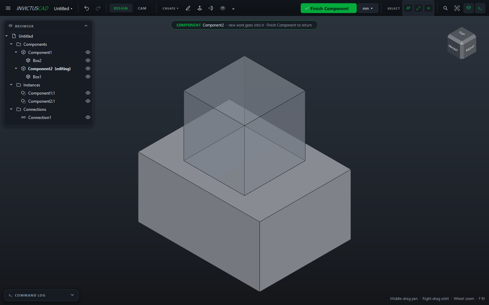

# Components and Instances

A **component** is a part definition; an **instance** is one placed copy of it. Change the
component and every instance changes. Use components for anything that appears more than once,
or to keep an assembly's parts separate.

## Make a component

1. Select the bodies that make up the part (in the browser or the view).
2. Choose **ASSEMBLE › Make Component**, or right-click a body in the browser › **Make
   Component**.

The bodies, their features, and any sketches and planes only they use move into the new
component. Its first instance, such as **Component1:1**, stays where the bodies were. Rename the
component in the browser (++f2++) and its instances follow: **Base:1**, **Base:2**.

## Add more instances

Right-click the component (or one of its instances) in the browser › **Add Instance**. The copy
appears beside the others.

## Move an instance

1. Double-click the instance in the browser, or select it and choose **ASSEMBLE › Move Instance**.
2. Type how far to move it (**Move X**, **Move Y**, **Move Z**) and, optionally, an **Angle** to
   turn it **about** Z, X or Y (around the instance's own origin). Moves are relative to where it
   is now.
3. Click **Move**.

To place parts against each other exactly, use [connections](connections.md) instead.

## Ground an instance

Right-click an instance › **Ground** to fix it in place: connections never move it, and Move
Instance refuses to. Grounded instances show **⚓**. **Release** undoes it.

## Edit a component in place

1. Double-click the component in the browser (or right-click › **Edit Component**).
2. A banner shows you're editing it, and **Finish Component** appears in the top bar. New sketches,
   features and bodies now go into the component, and you can sketch on its faces and use the rest
   of the assembly for reference.
3. Click **Finish Component** (or double-click the component again) to return.

Every instance updates as you work.

## Linked parts

A component can live in its own `.ivc` file and be used by several projects: a standard bracket,
a motor, a common enclosure.

- **Link a component to a file:** right-click it › **Link to File...** and choose where to save
  it. The component is now read from that file (its name shows **↗**).
- **Use the changes:** after the part's file changes, choose **ASSEMBLE › Update Links**. When
  you open a project whose linked files changed or went missing, InvictusCAD tells you. The
  project still opens with the last shape it had.
- **Bring it back into the project:** right-click › **Embed**.

A linked component can't be edited in place: open its own file to change it.
