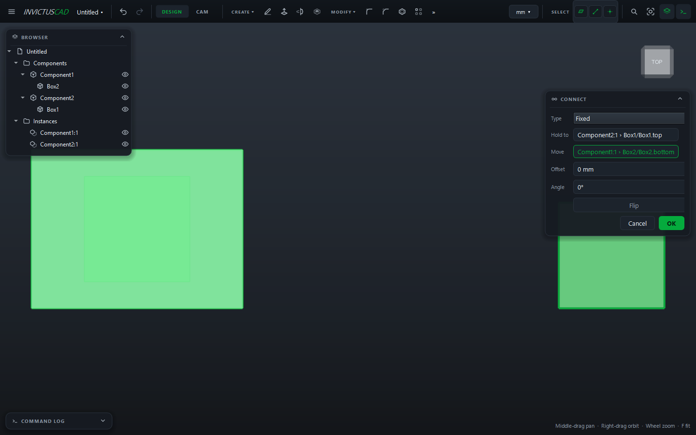
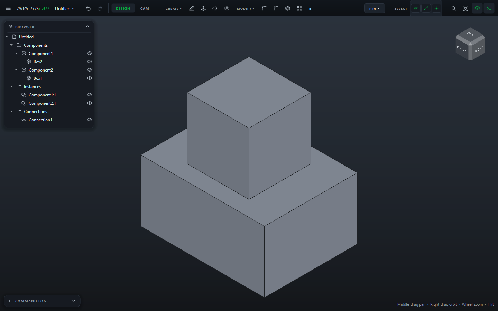

# Connections

A **connection** places one instance against another, and says how it may move: fixed, turning on
a hinge, sliding, and so on. Swing a hinge open by changing its angle.

Connections join **instances**, so [make components](components.md) of the parts first.

## Connect two parts

1. Choose **ASSEMBLE › Connect**.
2. Choose the **Type** (below).
3. **Hold to:** click a face, edge or point on the part that stays.
4. **Move:** click a face, edge or point on the part that moves to meet it.
5. Adjust the values. A preview shows the moved part.
6. Click **OK**.

### What to click

| Click | Gives |
|---|---|
| A flat face | Its center and the direction it faces |
| A round face, a circular edge, or a straight edge | Its axis |
| A point | Its position |

Two flat faces meet face to face. **Flip** turns the moving part over.

### Types

| Type | Moves | Values |
|---|---|---|
| **Fixed** | Not at all | **Offset**, **Angle** |
| **Hinge** | Turns about the axis | **Angle** |
| **Slider** | Slides along the axis | **Slide** |
| **Cylindrical** | Turns about and slides along the axis | **Angle**, **Slide** |
| **Planar** | Slides in the plane and turns | **Across**, **Along**, **Angle** |
| **Ball** | Turns any way about the point | **Angle**, **Tilt** |

**Offset** moves the part along the axis or away from the face, as a gap or a spacer would.

## Move a connected part

Double-click the connection in the browser, change its **Angle**, **Slide** or other values, and
click **OK**. To swing a lid open, change its hinge's Angle.

## Rules

- Only the part on the **Move** side moves.
- A [grounded](components.md#ground-an-instance) instance can't be the moving side: connect it the
  other way round.
- If a connection can't be met, it shows red in the browser; hover it for the reason.
