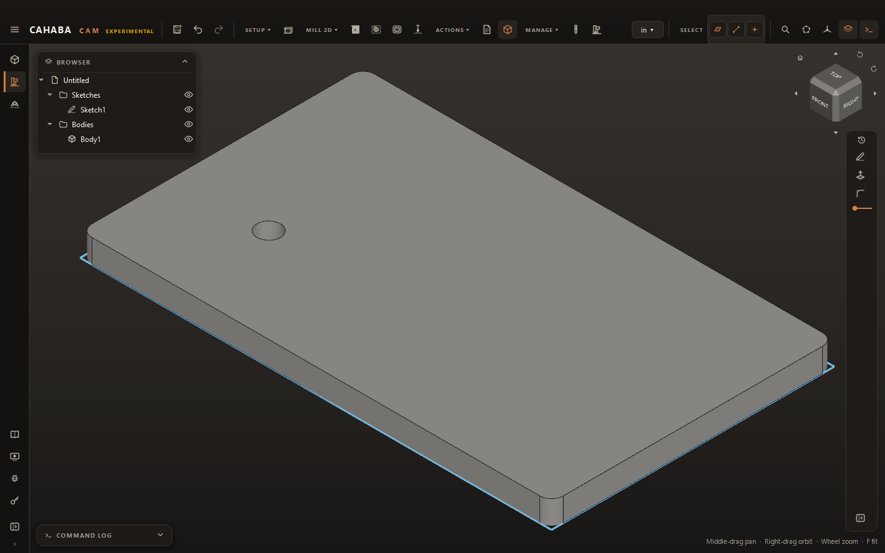
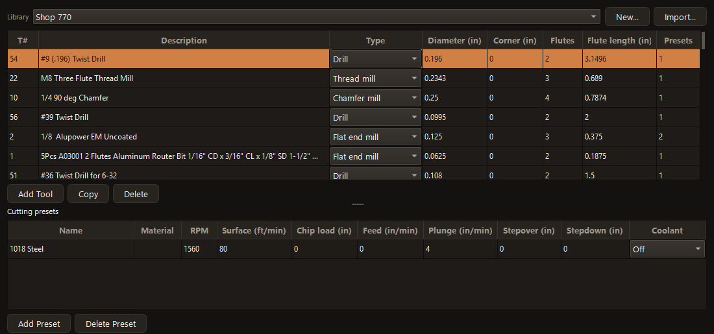
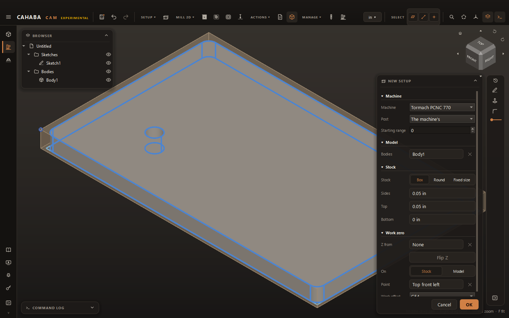
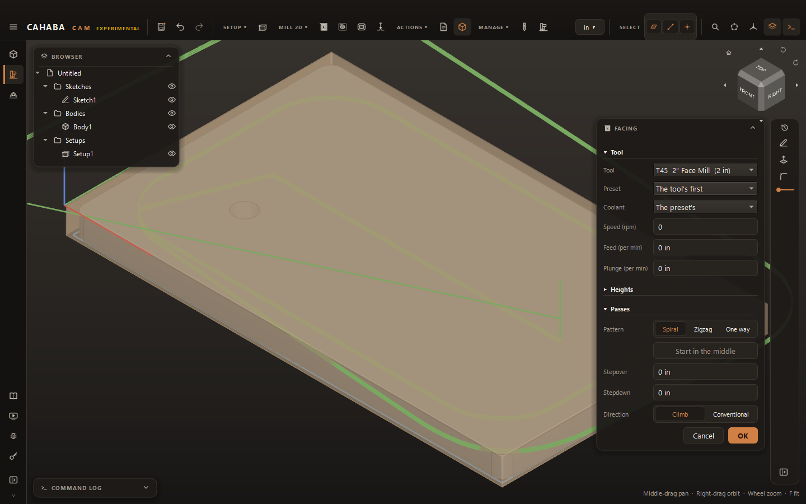
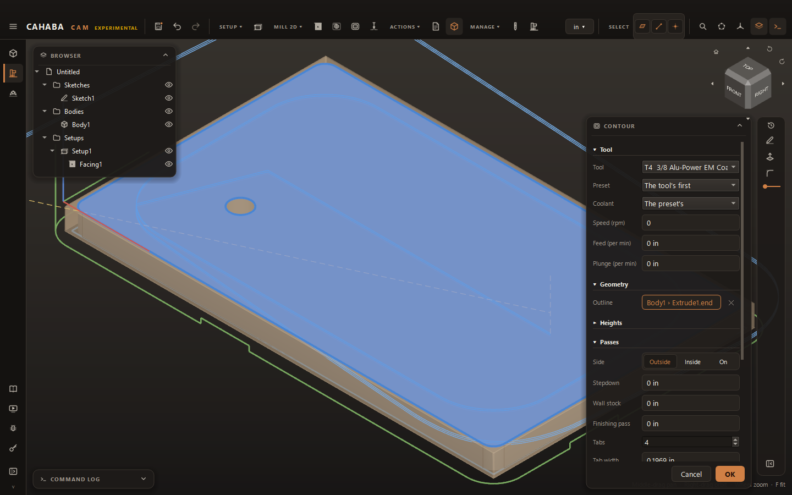
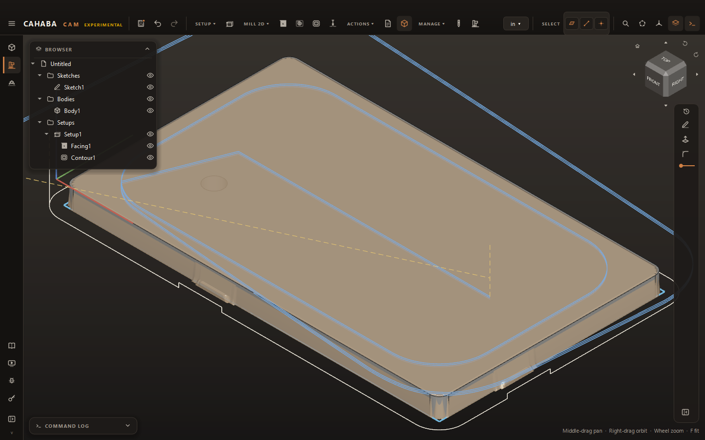
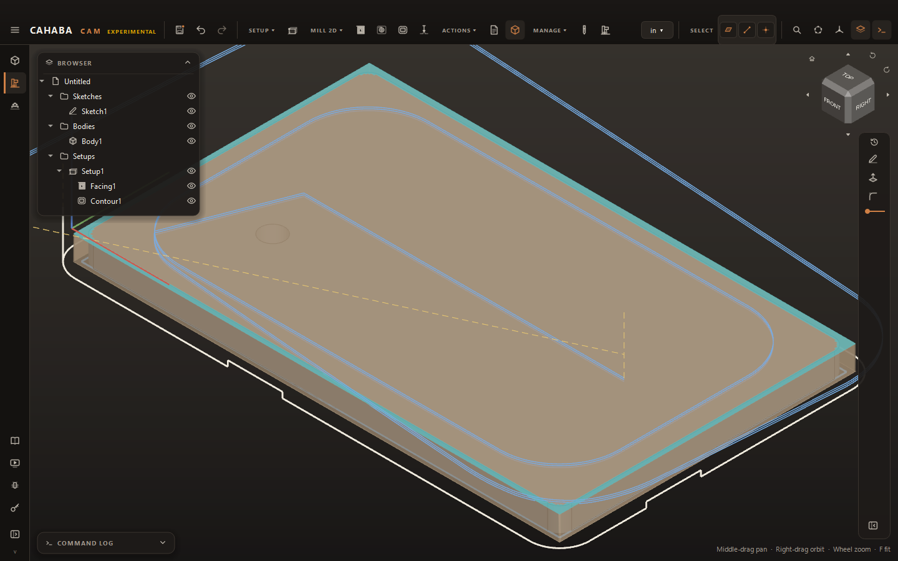
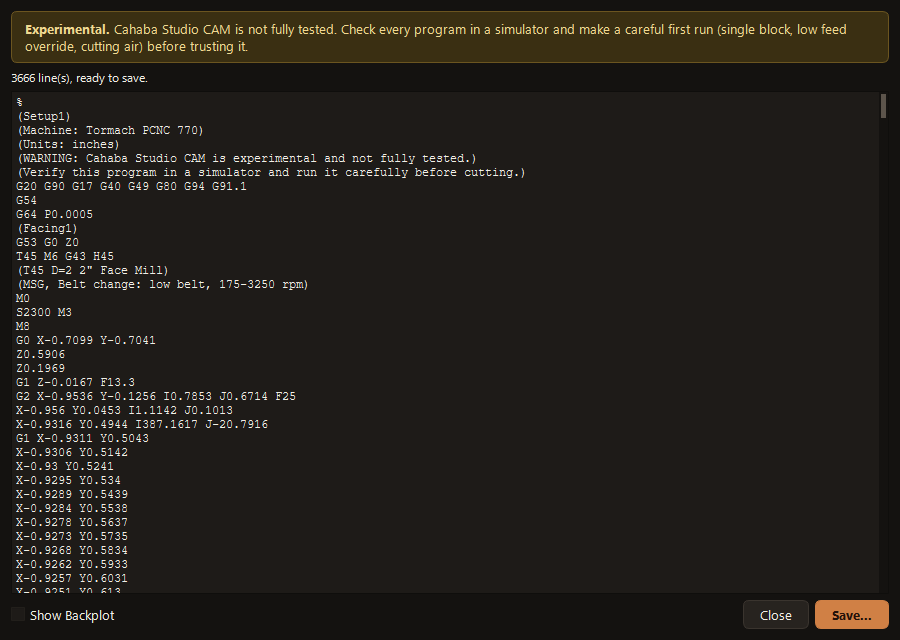
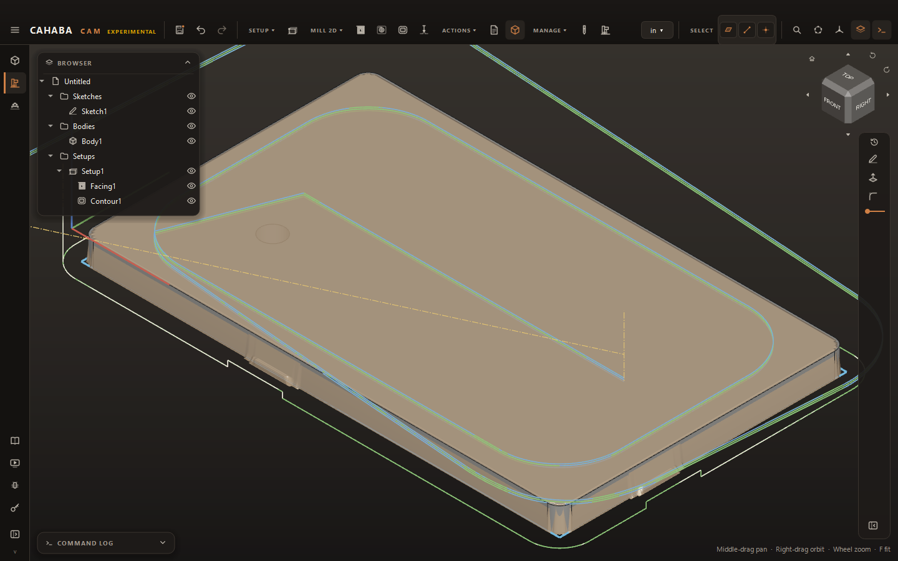

# CAM: From Model to G-code

The **CAM workspace** turns your bodies into G-code for a CNC mill or router. You pick a machine,
describe the stock and where zero is, add operations that each use one tool, then post a program
for your controller.

The pieces, in the order you use them:

| Piece | What it is | Page |
|---|---|---|
| **Machine** | Travels, feeds, spindle ranges, coolant and the post (controller) it uses | [Machines](machines.md) |
| **Tool library** | Your cutters and their cutting presets (speeds and feeds) | [Tool libraries](tool-libraries.md) |
| **Setup** | Which bodies, the stock around them, and the work zero | [Setups](setups.md) |
| **Operation** | One toolpath: facing, pocket, adaptive clearing, contour or drilling | [Operations](operations.md) |
| **Post** | The G-code file for your controller, after checks | [Check and post](post.md) |

Cahaba Studio currently makes **2D milling** toolpaths (2.5-axis: flat floors, vertical walls,
holes) for three-axis mills and routers. Posts are included for **Tormach PathPilot**,
**LinuxCNC** and **GRBL**.

## Your first program

This walks through facing and cutting out the 5 × 3 inch plate from
[Your first part](../getting-started/first-part.md) on a Tormach PCNC 770. Open that part (or any
body of your own) in Cahaba Studio first.

### 1. Switch to CAM

In the top bar, click **CAM** (next to **DESIGN**). The toolbar changes to **SETUP**, **MILL 2D**,
**ACTIONS** and **MANAGE**.

### 2. Import your tools

You do this once. Click **MANAGE › Tool Library**, then **Import...**, and choose a tool library
exported from Fusion (`.json`). The tools and their cutting presets appear; click **Close**.

No Fusion library? Click **New...** and add tools by hand instead. See
[Tool libraries](tool-libraries.md).

### 3. Add a setup

1. Click **SETUP › New Setup**. **Bodies** already lists the plate, and the bronze box around it is
   the stock.
2. Choose **Machine: Tormach PCNC 770**.
3. Leave **Stock** on **Box**: 0.05 in extra on the **Sides** and **Top**.
4. Leave the work zero **Point** on **Top front left**: the top front left corner of the stock,
   where you'll touch off.
5. Click **OK**.

**Starting range** 0 means the program stops at the start and says which belt to use. Set it to
the range your 770 is already in to skip that stop.

### 4. Face the top

1. Click **MILL 2D › Facing**.
2. Choose the **Tool**: a face mill (here, T45, a 2" face mill). The spiral toolpath appears.
3. Click **OK**.

### 5. Cut the outline

1. Click **MILL 2D › Contour**.
2. Choose the **Tool**: an end mill (here, T4, a 3/8" end mill).
3. Click the **Outline** field, then the plate's top face in the view. The path goes around its
   outside edge.
4. Leave **Side** on **Outside**, and set **Tabs** to `4` so the plate stays attached to the stock.
5. Click **OK**.

### 6. Look at the result

With **ACTIONS › Show Stock** on (it is by default), the stock shows what's left after both
operations: the top faced, the outline cut, the tabs holding the plate.

Click **Contour1** in the browser to see the stock **before** the contour, with what it removes in
teal.

### 7. Post

1. Click **ACTIONS › Post**. The Post window shows the program and, above it, any errors or
   warnings. This one is ready to save.

    

2. Tick **Show Backplot** to see the program drawn in the view as the machine will read it.

    

3. Click **Save...**. The file is named after the setup, with PathPilot's `.nc` extension.

!!! warning "Always prove a program out"
    Cahaba Studio checks feeds, spindle speeds, rapids through the stock and travel limits, but it
    doesn't simulate the tool holder or check for collisions with your vise or fixtures. Air-cut
    new programs and keep a hand near the feed hold.

## Working with CAM

- **The browser** has a **Setups** folder. Each setup holds its operations. Double-click a setup or
  operation to change it; right-click a setup for **Post...**. An item turns red when it can't be
  calculated; hover it to see why.
- **Toolpaths** draw in the CAM workspace only: feeds solid, in a color for each kind of operation (facing
  blue, pockets rose, contours white, and so on), rapids dashed yellow. The selected
  operation is drawn bold. Hide one with its eye in the browser.
- **Model changes flow through.** Edit the part in DESIGN and its operations recalculate.
- **Switch back** with **DESIGN** in the top bar. Opening a sketch also returns you to DESIGN.
