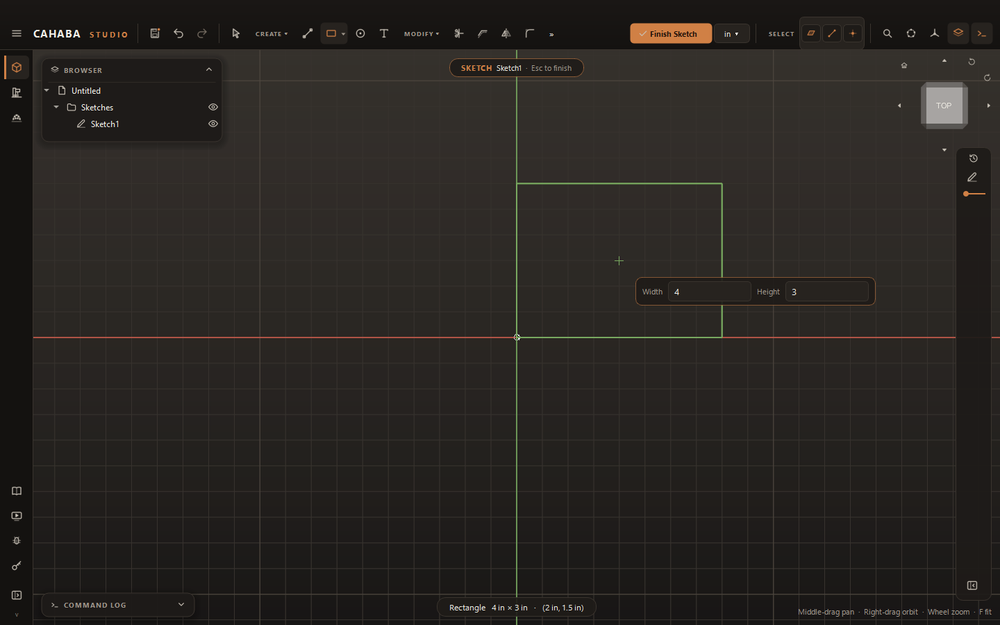
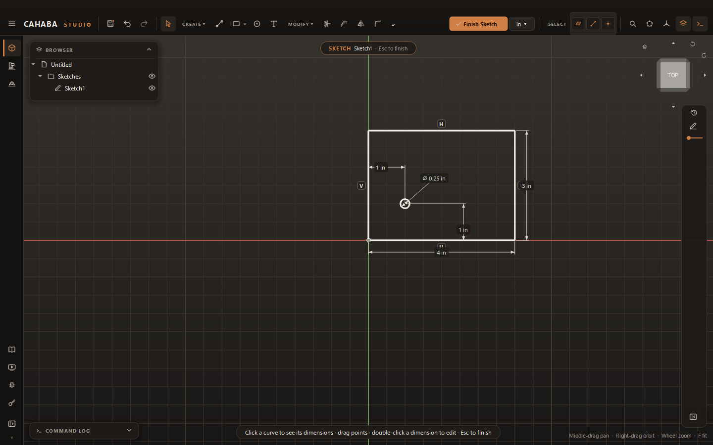
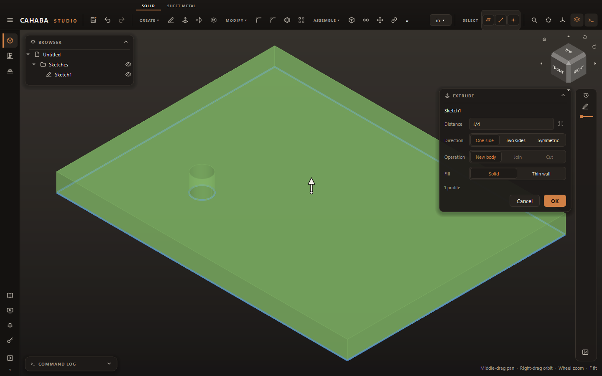
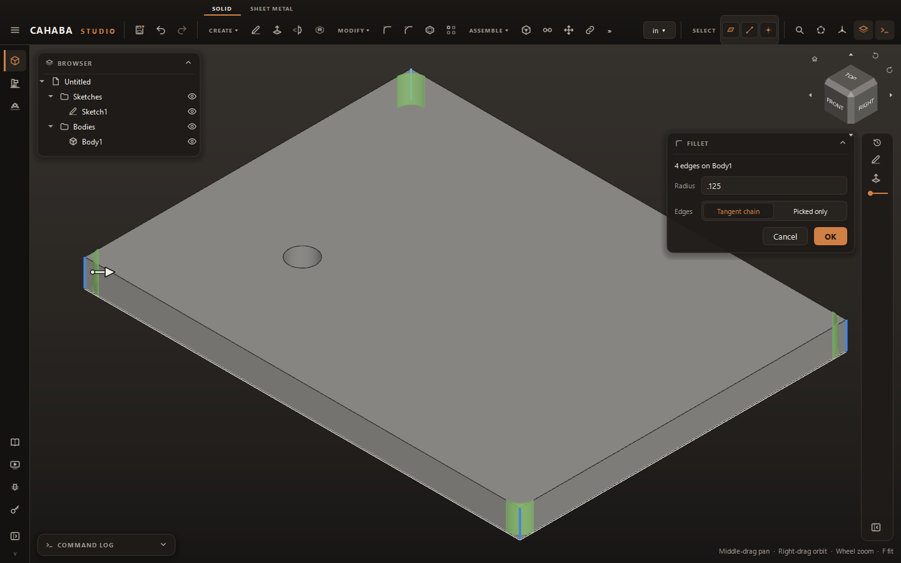
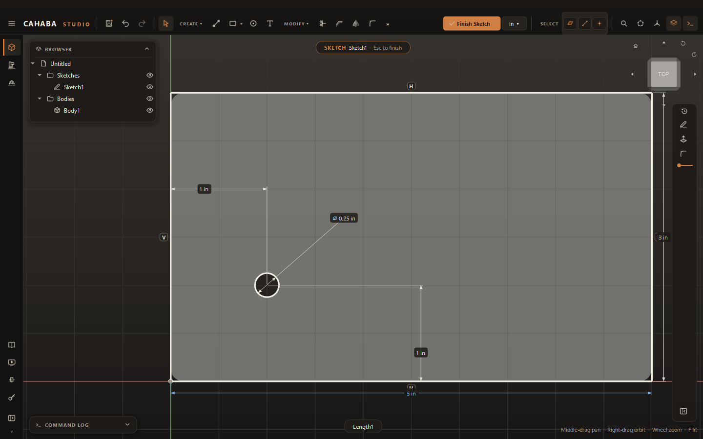

# Your First Part

This tutorial makes a 4 × 3 inch mounting plate, 1/4 inch thick, with a hole and rounded
corners. It takes about five minutes and covers the steps nearly every part uses: sketch,
constrain, extrude, add features, save.

## 1. Set the unit

Click the unit button in the top bar (**mm ▾**) and choose **Inches**. Plain numbers you type now
mean inches. (You can still type `6mm` anywhere.)

## 2. Start a sketch

1. Click **Sketch** in the **CREATE** panel. The three origin planes appear.
2. Click the **XY** plane (the blue one, lying flat).

The view turns to look down on the plane, and a grid appears.

## 3. Draw the plate

1. Press ++r++ for **Rectangle**.
2. Click the origin (where the red and green axes cross), and move the mouse up and to the right.
3. Type `4`, press ++tab++, type `3`, and press ++enter++.

The rectangle is 4 × 3 inches, with its corner on the origin. Because you typed the sizes, they
are dimensions, and the sides turn white as they become fully constrained.

## 4. Add a hole

1. Press ++c++ for **Circle**. Click inside the rectangle, toward the lower left, for the center;
   move out a little and click again.
2. Press ++d++ for **Dimension**. Click the circle, click beside it to place the label, type `0.25`
   and press ++enter++.
3. Still in Dimension, click the circle's **center**, then the **left side** of the rectangle.
   Click to place the label, type `1` and press ++enter++.
4. Do the same from the center to the **bottom side**: `1`.

The hole is ¼ inch across, 1 inch in from the left and the bottom. Everything is white: fully
constrained.

## 5. Extrude

1. Press ++e++ (or click **Extrude** in the toolbar). The sketch closes and the **Extrude** card
   opens.
2. Type `1/4` in **Distance**. The green preview shows the plate, with the circle as a hole
   through it.
3. Click **OK**.

## 6. Round the corners

1. Click the view cube's top front right corner to see the plate at an angle.
2. Choose **MODIFY › Fillet**.
3. Click the three short vertical edges you can see at the corners.
4. The fourth is at the back. Right-drag to orbit until you can see it (or click the view cube's
   top back left corner), and click it. The card says **4 edges on Body1**.
5. Type `.125` for the **Radius** and click **OK**.

## 7. Change your mind

1. Double-click **Sketch1** in the browser. The sketch opens again.
2. Double-click the `4 in` dimension, type `5` and press ++enter++.

3. Click **Finish Sketch** (or press ++esc++).

The plate rebuilds 5 inches long, and the fillets stay on their corners.

## 8. Save

Press ++ctrl+s++, choose a name and folder, and click **Save**. Projects are `.cb3` files.

## Where next

- [Sketch basics](../sketching/index.md) and [Constraints and dimensions](../sketching/constraints.md)
- [Extrude](../modeling/extrude.md), [Holes and threads](../modeling/holes-and-threads.md)
- Send it to a laser or router as a [flat part](../making/flat-parts.md), or machine it in
  [CAM](../cam/index.md)
