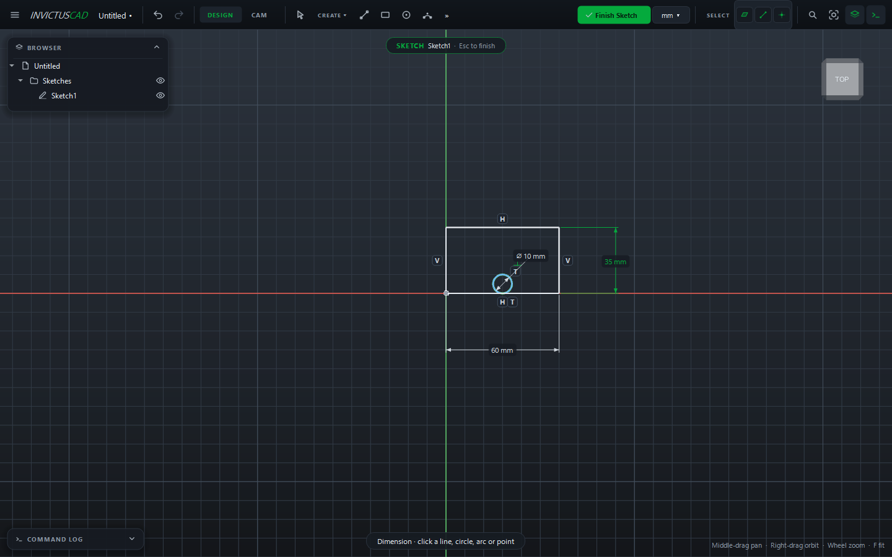
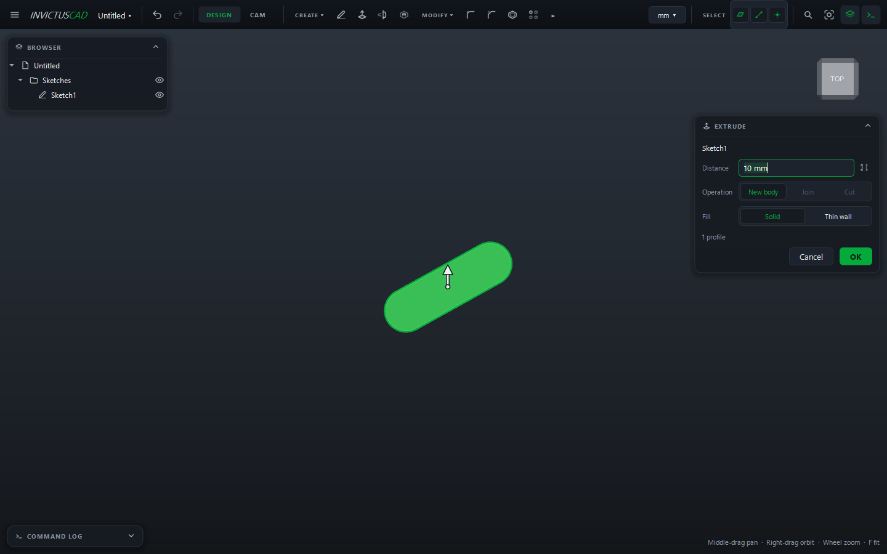

# Your First Part

This tutorial makes a 4 × 3 inch mounting plate, 1/4 inch thick, with a hole and rounded
corners. It takes about five minutes and covers the steps nearly every part uses: sketch,
constrain, extrude, add features, save.

## 1. Set the unit

Click the unit button in the top bar (**mm ▾**) and choose **Inches**. Plain numbers you type now
mean inches. (You can still type `6mm` anywhere.)

## 2. Start a sketch

1. Click **Sketch** in the **CREATE** panel.
2. Click the **XY** plane (the blue square).

The view turns to look down on the plane, and a grid appears.

## 3. Draw the plate

1. Press ++r++ for **Rectangle**.
2. Click the origin (where the red and green axes cross), and move the mouse up and to the right.
3. Type `4`, press ++tab++, type `3`, and press ++enter++.

The rectangle is 4 × 3 inches, with its corner on the origin. Because you typed the sizes, they
are dimensions: the sides turn white as they become fully constrained.

## 4. Add a hole

1. Press ++c++ for **Circle**.
2. Click inside the rectangle for the center, move out a little, and click again.
3. Press ++d++ for **Dimension**, click the circle, click to place the label, type `0.25` and
   press ++enter++.
4. Still in Dimension, click the circle's center and then the left side of the rectangle, place
   the label, type `1` and press ++enter++. Do the same from the center to the bottom side.

Now the hole is ¼ inch, 1 inch in from the left and bottom. Its curve turns white.

## 5. Extrude

1. Press ++e++. The sketch closes and the **Extrude** card opens.
2. Type `1/4` in **Distance**. The preview shows the plate, with the circle as a hole through it.
3. Click **OK**.

## 6. Round the corners

1. Click the view cube's corner to see the plate at an angle.
2. Choose **MODIFY › Fillet**.
3. Click the four short vertical edges at the corners.
4. Type `0.125` for the **Radius** and click **OK**.

## 7. Change your mind

Double-click **Sketch1** in the browser, double-click the `4` dimension, type `5`, press
++enter++, then press ++esc++ to finish the sketch. The plate rebuilds 5 inches long, and the
fillets stay on their corners.

## 8. Save

Press ++ctrl+s++, choose a name and folder, and click **Save**. Projects are `.ivc` files.

## Where next

- [Sketch basics](../sketching/index.md) and [Constraints and dimensions](../sketching/constraints.md)
- [Extrude](../modeling/extrude.md), [Holes and threads](../modeling/holes-and-threads.md)
- Send it to a laser or router as a [flat part](../making/flat-parts.md), or machine it in
  [CAM](../cam/index.md)
