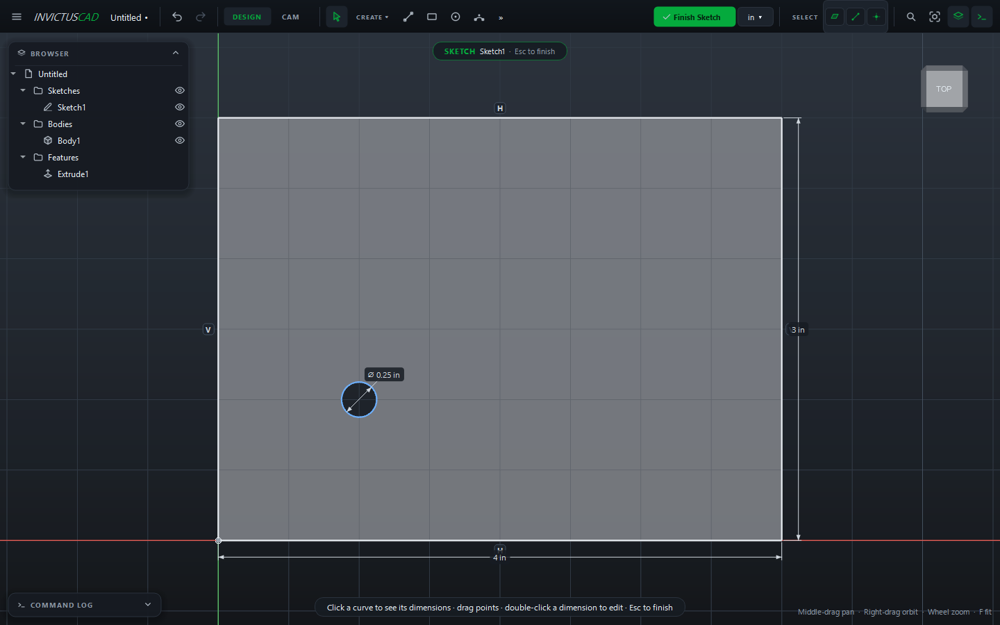

# Navigating and Selecting

## Move the view

| Action | Mouse |
|---|---|
| **Pan** | Middle-drag |
| **Orbit** | Right-drag, or ++shift++ + middle-drag |
| **Zoom** | Mouse wheel (zooms toward the cursor) |
| **Fit everything** | ++f++ or ++home++ (in a sketch, fits the sketch) |

Orbiting turns around the model's center and has no stop at the top or bottom, so you can roll
right over it.

## Standard views

- **View cube** (top right): click a face, edge or corner to look from there.
- **☰ › View**: **Home View**, **Front**, **Top**, **Right** and **Isometric**.

Around the view cube:

| Button | |
|---|---|
| **Home** (top left) | Back to the home view, fitted to the model. It's isometric until you set your own |
| **Arrows** (above, below, left, right) | Turn 90° to the face on that side |
| **Curved arrows** (top right) | Roll the view 90° left or right |

Right-click the cube for more:

| Item | |
|---|---|
| **Home View**, **Fit** | As the buttons |
| **Orthographic**, **Perspective** | How the view is drawn. Orthographic keeps parallel lines parallel; perspective looks the way a camera sees |
| **Set Current View as Home**, **Reset Home** | Make the view you're looking at the home view, or go back to isometric |
| **Set Current View as Front**, **Reset Front** | Make the side you're looking at the front, squared up to the nearest axes. The cube's faces and Front, Top and Right follow |

These are remembered between sessions.

## SpaceMouse

A 3Dconnexion SpaceMouse moves the view as soon as it's plugged in. It works the way its "object
mode" does: the model follows the cap.

| Move the cap | The view |
|---|---|
| Push left or right, lift or press | Pans |
| Push forward or pull back | Zooms |
| Tilt, twist or roll | Turns the model the same way |

The left button fits the view; the right button goes to the home view. Set its **Speed**, and
reverse panning, zooming or turning if they go the wrong way for you, in
[Preferences](preferences.md).

## Select

Left-click to select a face, edge or vertex. Hold ++ctrl++ or ++shift++ to add or remove.
++esc++ clears the selection.

The **SELECT** buttons in the top bar choose what clicks can pick. Turn off faces, for example,
to pick edges easily. Some tools set this for you: Fillet and Chamfer pick edges, Shell, Hole and
Thread pick faces.

Clicking a body, sketch, plane or instance in the browser highlights it in the view too.

When one thing is selected, its name and size appear at the bottom of the view: the face's area,
an edge's length or diameter, a vertex's coordinates. To measure between things, use
[Measure](../modeling/measure.md).

## How things are named

Bodies, sketches and features get names such as `Body1`, `Sketch2` and `Extrude1`. These names are
permanent; renaming in the browser only changes the label you see. Faces and edges are named after
the features that made them (`Body1/Extrude1.end` is the end face of Extrude1), which is how later
features keep finding them after you edit earlier ones.
