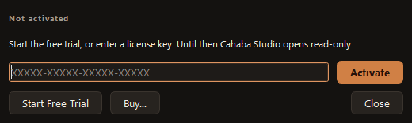

# Free Trial and Activation

## The free trial

Just start Cahaba Studio. The first time it opens on a computer connected to the internet, it starts
a **30-day free trial** by itself: every feature, no card, no account. The top bar shows how many
days are left; click it to open **Help › License**.

The trial belongs to that computer. Reinstalling doesn't restart it.

!!! note "Offline the first time?"
    The trial needs to reach cahaba3d.com once to start. Until then Cahaba Studio opens in
    [read-only mode](../license/read-only.md). Connect, then choose **☰ › Help › License ›
    Start Free Trial** (or just restart Cahaba Studio).

## Buy a license

Buy at [cahaba3d.com/pricing](https://cahaba3d.com/pricing). Your license key arrives by
email within a minute or so. It looks like `ABCDE-FGHJK-MNPQR-STVWX`.

## Activate your license

1. In Cahaba Studio, choose **☰ › Help › License**, or click the trial or **Read-only** label in the
   top bar.
2. Paste or type the key into the box. Dashes, spaces and lowercase are fine.
3. Click **Activate**.

The dialog shows who it's licensed to and your updates date. Anything you made during the trial
keeps working.

### Already on two computers?

A license can be active on **2 computers** at a time. If both are taken, the dialog lists them with
when each was last used. Click **Release and Use Here** next to the one you no longer use, and the
license moves to this computer. See [Move to another computer](../license/move-computers.md).

## Working offline

After activating, Cahaba Studio works without an internet connection. When it's online it checks in
once a day, in the background, to pick up renewals. If it can't reach the server it carries on and
tries again another day.

!!! tip "Lost your key?"
    Get it emailed again from [cahaba3d.com/license](https://cahaba3d.com/license).
