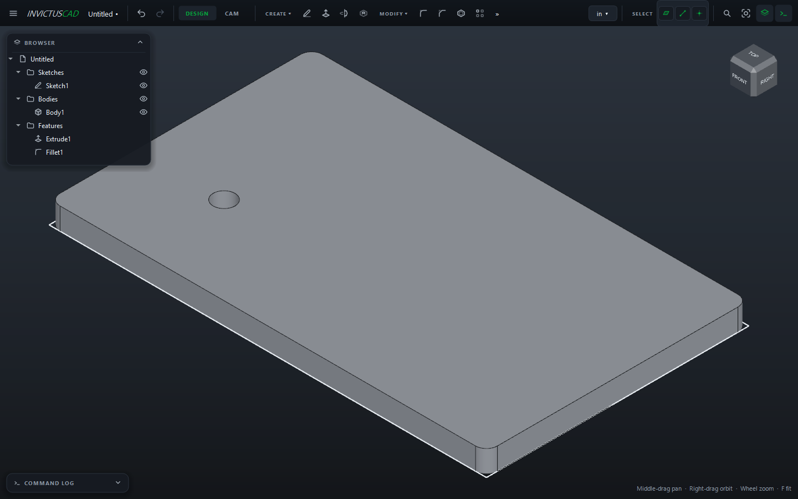

# The InvictusCAD Window

## Top bar

From left to right:

| | |
|---|---|
| **☰ Menu** | **File** (New, Open, Save, Save As, Show Backups Folder), **Edit** (Undo, Redo, Delete, Clear Selection, [Preferences](preferences.md)), **Create**, **View** (Fit, Front, Top, Right, Isometric, Browser, Command Log) and **Help** (License, Capture Window, Open Crash Reports Folder) |
| **Document name** | A **•** after it means there are unsaved changes. Hover it for the file's full path |
| **Undo / Redo** | ++ctrl+z++ / ++ctrl+y++. Hover them to see which step they'd undo or redo |
| **DESIGN / CAM** | Switch between modeling and the [CAM workspace](../cam/index.md) |
| **SOLID / SHEET METAL** | Which tools show in Design: solid modeling or [sheet metal](../modeling/sheet-metal.md) |
| **Tool panels** | **CREATE**, **MODIFY**, **ASSEMBLE**, **MAKE**, **INSPECT**. In a sketch these change to the sketch tools |
| **Unit** (**mm ▾**) | The document's display unit: millimeters, centimeters, meters, inches or feet |
| **SELECT** | Which things clicks pick: faces, edges and vertices. Turn one off to make the others easier to click |
| **🔍 Search** | Find any tool by name (++ctrl+k++) |
| **Fit** | Fit the model in the view (++f++ or ++home++) |
| **Origin** | Show the X, Y and Z axes through the origin, dimmed (also **View › Origin**) |
| **Browser**, **Command Log** | Show or hide them (++ctrl+b++, ++ctrl+l++) |

### Tool panels

Each panel shows four tools. Click the panel's name (**CREATE ▾**) for all of them. Its
**Toolbar** submenu chooses between **Show Pinned Tools** and **Show Last 4 Used**, and lets you
tick which tools are pinned. In a narrow window, panels that don't fit move under **»**.

| Panel | Tools |
|---|---|
| CREATE | Sketch, Extrude, Revolve, Hole, Sweep, Loft, Thread, Box, Reference Plane |
| MODIFY | Fillet, Chamfer, Shell, Rectangular Pattern, Circular Pattern, Path Pattern, Mirror Features, Delete, Parameters |
| ASSEMBLE | Make Component, Connect, Move Instance, Update Links |
| MAKE | Export Flat, Nest Parts |
| INSPECT | Measure, Section Analysis |

## Browser

The panel at the top left lists everything in the document, in folders: **Components**,
**Instances**, **Connections**, **Planes**, **Sketches**, **Bodies**, **Features** (in the order
they were made) and **Setups** (CAM).

| To | Do |
|---|---|
| Show or hide something | Click its eye. A folder's eye hides or shows everything in it |
| Rename | Select and press ++f2++, or right-click › **Rename**. Only the name you see changes; everything that uses it keeps working |
| Edit | Double-click a sketch, feature, plane, component, instance or connection to open it |
| More actions | Right-click: export, make component, save as footprint, link to file, post... |
| Find out why something failed | Failed features are red; hover for the reason |

Select a body in the browser to see its volume and face, edge and vertex counts at the bottom of
the view.

## Command Log

The panel at the bottom left (collapsed at first) shows every action as the command it ran, such
as `extrude(sketch="Sketch1", distance=10)`. Undo and redo are listed too, and failures in red with
the reason. It's the same language scripts and [AI assistants](../automation/mcp.md) use.

## Cards

Most tools open a **card** at the right of the view with the tool's settings. A preview updates
as you change them.

- **Pick fields** read **Select** when empty. Click one (it reads **Click in the view...**), then
  click geometry in the view. **✕** clears it.
- A field turns red when its value can't be used; hover it to see why.
- **OK** applies; **Cancel** or ++esc++ closes the card without changes. OK stays disabled while
  something is missing, and the card says what.

## Messages

Problems appear briefly at the top of the view, such as a constraint that conflicts or a hole that
won't fit. Nothing is changed when a command is refused.

## Esc

++esc++ steps back one level at a time: it closes the plane picker or the open card, clears
measure picks, cancels a shape you're drawing, puts down the sketch tool, finishes the sketch, and
finally clears the selection.
