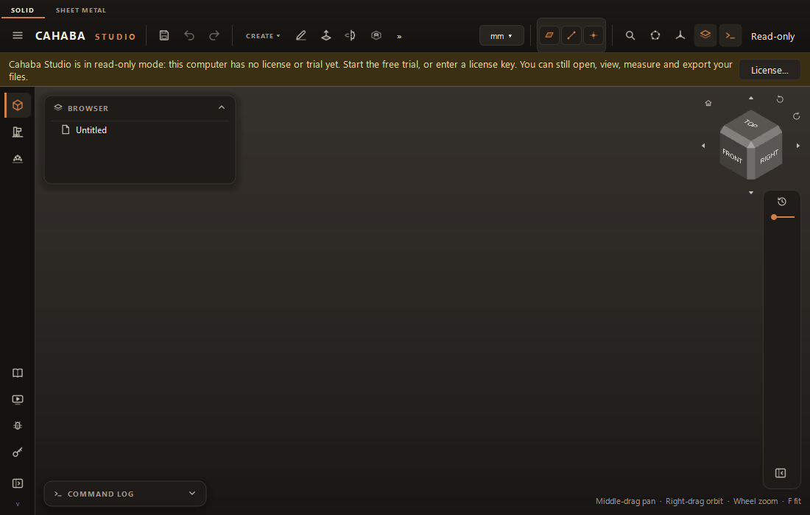

# Read-Only Mode

Without a license or trial, Cahaba Studio opens **read-only**. It never locks you out of your
files: you can always

- open projects, look around and measure;
- show and hide things and change the display unit;
- export flat parts, sketches and nests, and post CAM programs;
- save copies.

What you can't do is change the model: commands, undo and redo are refused with a message.

A banner under the top bar says why it's read-only, and the top bar shows **Read-only**. Click
**License...** on the banner to fix it.

## Why it happens, and what to do

| The banner says | Do this |
|---|---|
| *This computer has no license or trial yet* | Connect to the internet and choose **Start Free Trial**, or enter your license key. See [Free trial and activation](../getting-started/trial-and-activation.md) |
| *Your trial has ended* | [Buy a license](https://cahaba3d.com/pricing), then enter the key in **☰ › Help › License** |
| *Your license covers updates released until (date), and this version is newer* | [Renew updates](renew.md) and click **Refresh**, or install a version released by that date |

If your license was released from another computer or the website, or refunded, Cahaba Studio finds
out at its next daily check-in and goes read-only. Activate it again (or use another key) in
**☰ › Help › License**.
