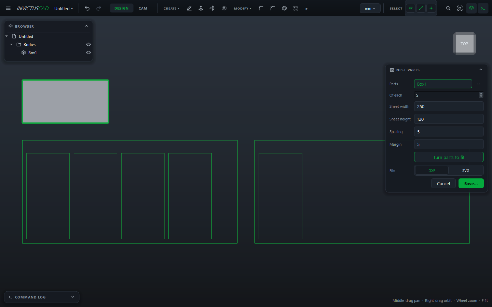

# Nest Parts on Sheets

**Nest Parts** lays flat parts out on sheets of material, as tightly as it can, and saves the
sheets as one DXF or SVG file ready to cut.

1. Select the bodies to cut in the browser (optional; you can pick them in the card).
2. Choose **MAKE › Nest Parts**.
3. Fill in the card:

    | Field | |
    |---|---|
    | **Parts** | The bodies to cut. Click one again to drop it |
    | **Of each** | How many of each part |
    | **Sheet width**, **Sheet height** | Your material's size |
    | **Spacing** | Gap between parts (allow for the kerf) |
    | **Margin** | Gap at the sheet's edges |
    | **Turn parts to fit** | Allow parts to turn 90° |
    | **File** | DXF or SVG |

4. The sheets are previewed below the model. If a part won't fit on a sheet, the card says which.
5. Click **Save...** and choose where to save.

The message shows how many parts went on how many sheets and how much of the material is used.
Each part is laid flat and turned to its tightest rectangle before packing. Every sheet's outline
is drawn on a **SHEET** layer (grey), next to the parts' usual
[cut and engrave layers](flat-parts.md#layers). Your sheet settings are remembered for next time.
