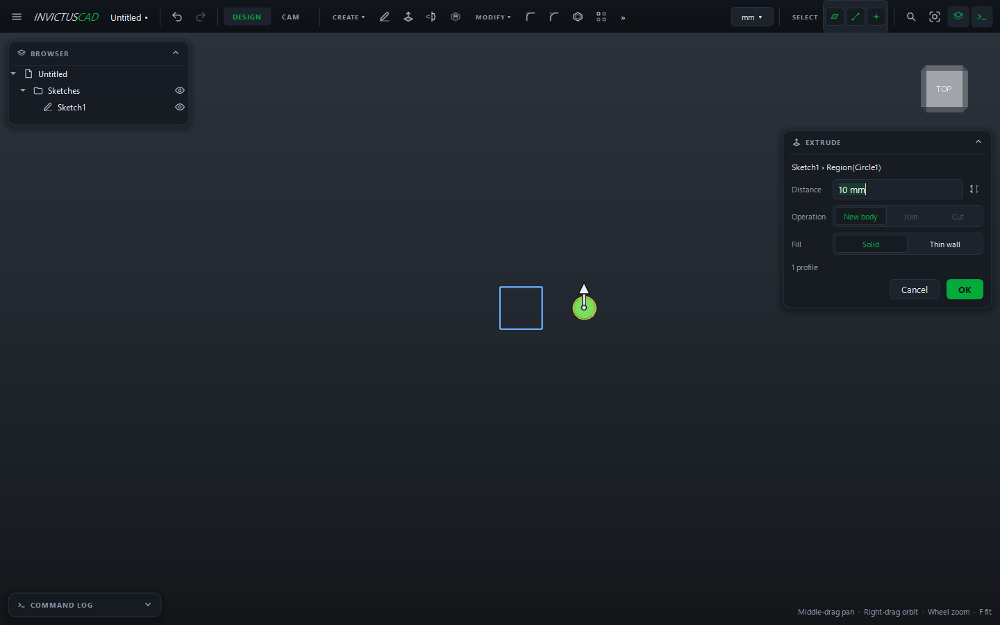
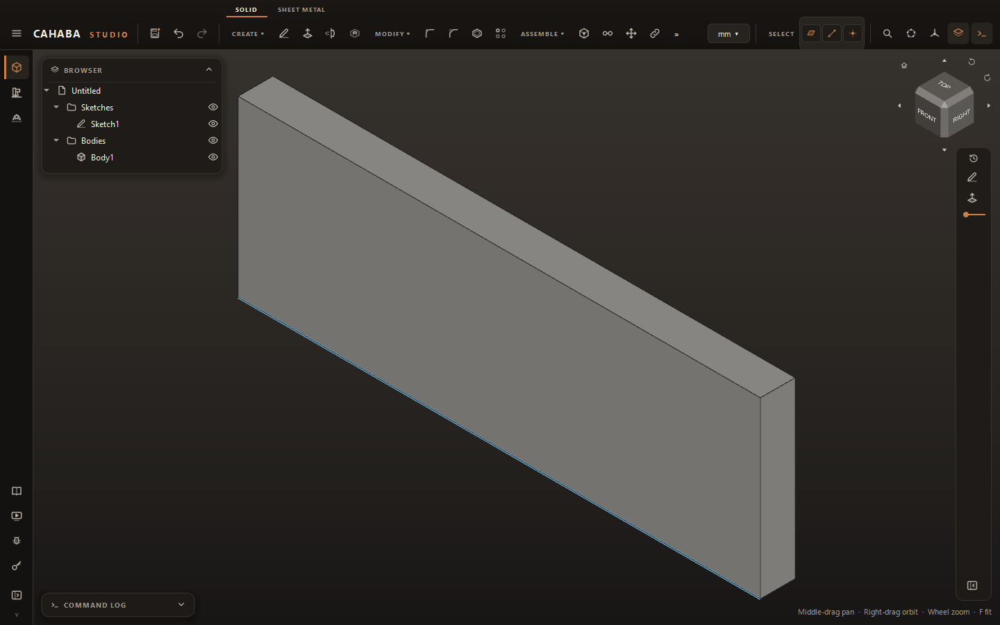

# Extrude

Extrude pushes a closed profile straight out to make a solid, add material to one, or cut into it.

## Extrude a sketch

1. Finish your sketch with ++e++ (or select a sketch in the browser and choose **CREATE ›
   Extrude**). The **Extrude** card opens with the whole sketch as the profile.
2. Type the **Distance**, or drag the arrow in the view (hold ++shift++ for finer steps). The
   ⇅ button beside the field flips the direction.
3. Choose the **Operation** (see below).
4. Click **OK** (or press ++enter++ in the Distance field).

## Choose what to extrude

With the card open, click in the view to change the profile:

- **Click a sketch curve** to use the whole sketch.
- **Click inside a closed region** to use just that region; click more regions to add them, and
  click one again to drop it.
- **Click a flat face of a body** to extrude that face.

The card shows how many profiles it's using. Open curves are ignored (unless you choose
**Thin wall**).

## Operation

| | |
|---|---|
| **New body** | A separate body |
| **Join** | Adds material to the body the sketch is on |
| **Cut** | Removes material from it (the direction flips into the part) |

**Join** and **Cut** are available when the sketch is on a face of a body (or you picked a face).
A sketch on an origin or reference plane makes a new body.

## Thin wall

Set **Fill** to **Thin wall** to extrude walls along the profile instead of a solid: a box, a
bracket from a single line, a tube from a circle.

| Field | |
|---|---|
| **Thickness** | Wall thickness |
| **Wall** | **Inside**, **Outside** or **Center** of the sketch line |

Thin wall also works on open curves.

## Change an extrude

Double-click it in the [History panel](history.md#the-history-panel). Change the distance, thickness or direction
and click **Update**. Everything after it rebuilds. To change its shape, edit the sketch instead.
