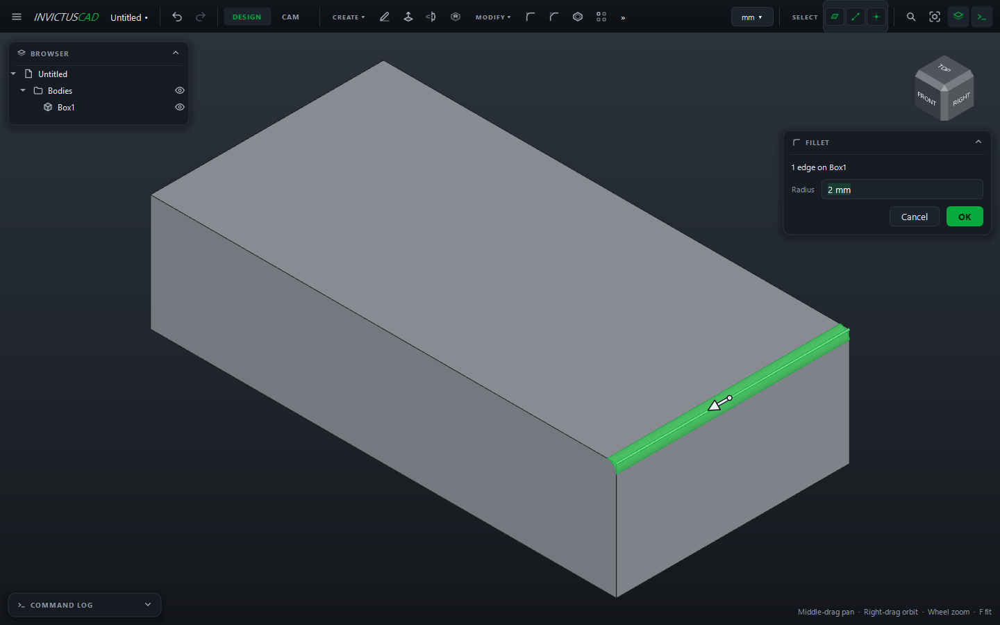
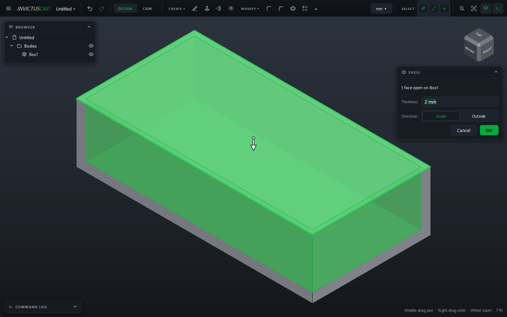

# Fillet, Chamfer and Shell

## Fillet and chamfer

Round (fillet) or bevel (chamfer) the edges of a body.

1. Choose **MODIFY › Fillet** or **Chamfer**. Picking switches to edges.
2. Click the edges. Click one again to drop it. Edges you selected before starting are already
   picked.
3. Type the **Radius** (fillet) or **Distance** (chamfer), or drag the arrow.
4. Click **OK**.

All the edges in one fillet must be on the same body. The last size you used is remembered. If a
radius won't fit, the card says so and OK stays disabled.

## Shell

Hollows a body out to a wall thickness: enclosures, cups, cases.

1. Choose **MODIFY › Shell**. Picking switches to faces.
2. Click the faces to remove: these become the openings (for example the top of a box). Leave
   them all unpicked to make a closed hollow body.
3. Set the **Thickness** and the **Direction**: **Inside** keeps the outside size, **Outside**
   keeps the inside size.
4. Click **OK**.

## Change them later

Double-click the fillet, chamfer or shell in the browser to change its size (and a shell's
direction), then click **Update**. To use different edges or faces, undo it and make it again.
