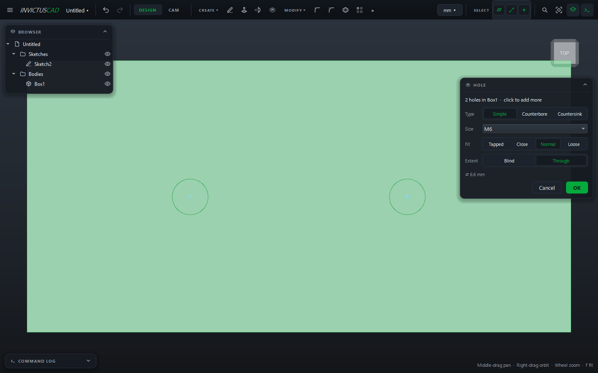

# Holes and Threads

## Add holes

1. Choose **CREATE › Hole** (++h++).
2. Click a flat face where each hole goes. Each click adds a hole. All the holes in one Hole feature
   go on the same face (or faces in the same plane).
3. Set the card:

    | Field | |
    |---|---|
    | **Type** | **Simple**, **Counterbore** or **Countersink** |
    | **Size** | A standard size (ISO metric M1–M64 and fine pitches, UNC #1–2", UNF #0–1-1/2") or **Custom diameter** |
    | **Fit** | For standard sizes: **Tapped** (tap drill size), **Close**, **Normal** or **Loose** clearance |
    | **Diameter** | For a custom size |
    | **Extent** | **Through**, or **Blind** with a **Depth** (drag the arrow, or type) |
    | **Thread** | For tapped holes: **Cosmetic** (drawn, not modeled) or **Modeled** |

4. Click **OK**.

The holes are placed by a sketch on that face, which is created for you and hidden afterwards.
To position them exactly, double-click that sketch in the browser and dimension its points, like
any other sketch.

!!! tip "Holes at sketch points"
    Already have a sketch on the face with points (or circles) where the holes go? Select it in
    the browser, then choose **Hole**: a hole goes at each point.

Counterbore and countersink sizes come from the standard for the screw size, so choose a standard
**Size** for those.

## Threads

Add a thread to a bolt, boss or hole.

1. Choose **CREATE › Thread**.
2. Click a cylindrical face: the outside of a shaft for an external thread, the inside of a hole
   for an internal one.
3. Set the card:

    | Field | |
    |---|---|
    | **Size** | **Auto (from the face)** picks the size matching the diameter, or choose one |
    | **Length** | The first option threads the full length; the second lets you type a **Length** |
    | **Thread** | **Cosmetic** or **Modeled** |

4. Click **OK**.

## Change holes and threads

Double-click the Hole or Thread in the browser, change its settings and click **Update**.
