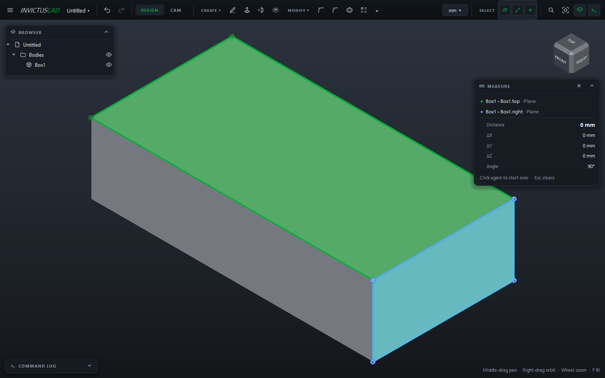

# Measure

1. Choose **INSPECT › Measure** (++m++).
2. Click a face, edge or vertex. The card shows what applies:
    - a face's **Area**;
    - a circle's **Diameter**, **Radius** and **Circumference**, or an arc's **Radius** and **Arc
      length**;
    - an edge's **Length**;
    - a vertex's **Position**, or a round item's **Center**.
3. Click a second item to measure between them. A dashed line joins the closest points, and the
   card adds:
    - **Distance** (the shortest);
    - **ΔX**, **ΔY**, **ΔZ**;
    - **Angle**, where one is defined;
    - **Center distance** between round items, such as hole spacing.
4. Click a third time to start over. ++esc++ clears the picks; press it again to close Measure.

You can select the values in the card and copy them. The **SELECT** buttons in the top bar limit
what clicks pick, which helps when faces and edges are close together.

For a quick look, just select one item: its size shows at the bottom of the view. Select a body in
the browser to see its volume.
