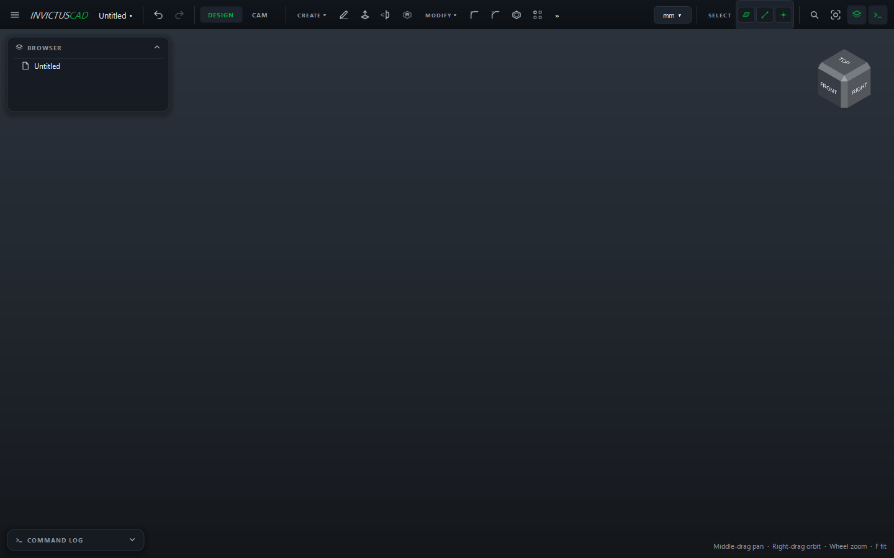
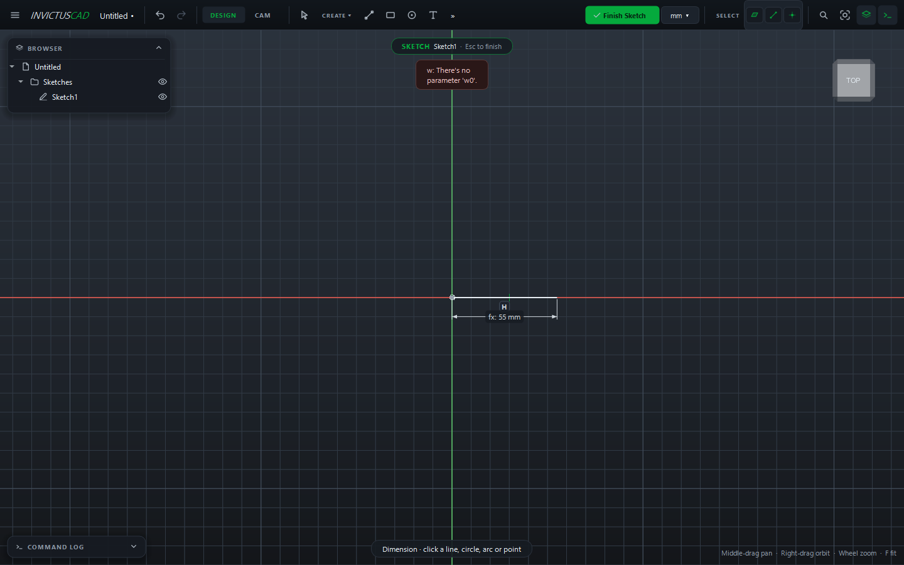

# Named Parameters

Parameters are named values, such as `panel_width = 6in` or `wall = 3mm`, that you use in
dimensions and feature values. Change the parameter and everything that uses it updates: one
place to resize a whole design.

## Add parameters

1. Choose **MODIFY › Parameters**. The Parameters window opens; it can stay open while you work.
2. Click **Add**. A new row appears, ready for its name.
3. Fill in the row:

    | Column | |
    |---|---|
    | **Name** | Letters, digits and `_`, starting with a letter. Not a unit name such as `mm` |
    | **Expression** | A value or calculation: `6in`, `25`, `panel_width / 2 - margin` |
    | **Value** | What it works out to (read only) |
    | **Comment** | A note for yourself |

## Use them

Type a parameter's name, or a calculation with it, in a sketch dimension or a feature value:
`panel_width`, `wall * 2`, `hole_x + 1/4"`. A sketch dimension that uses a parameter shows
**fx:** before its value.

!!! note
    While drawing, letters are tool shortcuts, so type a parameter name after pressing ++tab++ into
    a field, or when editing a dimension.

## Change and rename

- **Change a value:** edit its **Expression**. Everything that uses it updates.
- **Rename:** edit its **Name**. Every dimension and value that uses it follows the new name.
- **Delete:** select it and click **Delete**. A parameter that's in use can't be deleted; the
  window says what uses it.

A change that would break something, such as a parameter that refers to itself, is refused, and
the window says why.
