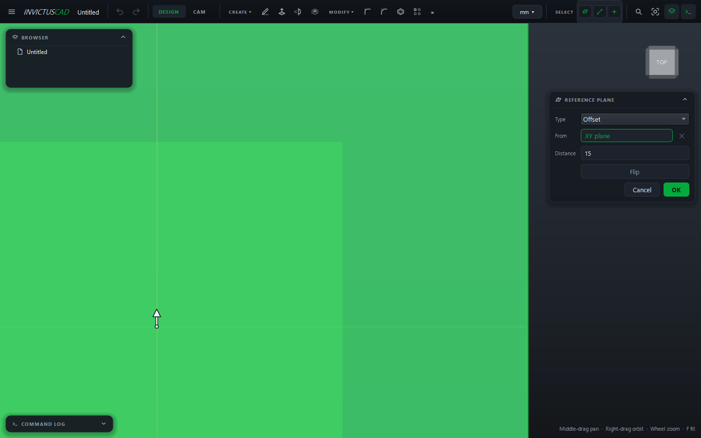

# Reference Planes

A reference plane is a flat plane you place yourself, for sketching where there's no face: on a
slant, halfway through a part, across a path for a sweep. Reference planes are teal. They follow
whatever they were made from, and sketches on them follow the plane.

## Make one

1. Choose **CREATE › Reference Plane**.
2. Choose the **Type**.
3. Click the geometry for each field (the card moves on after each pick), and set the values.
4. Click **OK**.

| Type | Pick | Values |
|---|---|---|
| **Offset** | **From**: a plane or flat face | **Distance** (or drag the arrow) |
| **At an angle** | **Hinge**: the line it turns about; **From** (optional): the plane it starts from | **Angle** |
| **Midway** | **First** and **Second**: planes or faces | — Parallel picks give the plane halfway between; otherwise the plane that bisects them |
| **Three points** | **Point 1**, **Point 2**, **Point 3** | — |
| **Through a line** | **Line**, and **And**: a second line or a point | — |
| **Tangent** | **Face**: a cylinder or sphere; **At** (optional): a point | **Angle**, used when there's no point |
| **Normal to a curve** | **Curve**; **At** (optional): a point on it | **Position**: 0 at the curve's start, 1 at its end |

- **Planes** you can pick: XY, XZ, YZ, other reference planes, flat faces.
- **Lines:** the X, Y and Z axes, straight edges, sketch lines.
- **Points:** the origin, vertices, sketch points.

**Flip** turns the plane the other way. For **Offset** and **At an angle**, flipping and typing a
negative value are the same thing.

To change a plane, double-click it in the browser. To sketch on it, choose **Sketch** and click the
plane.
