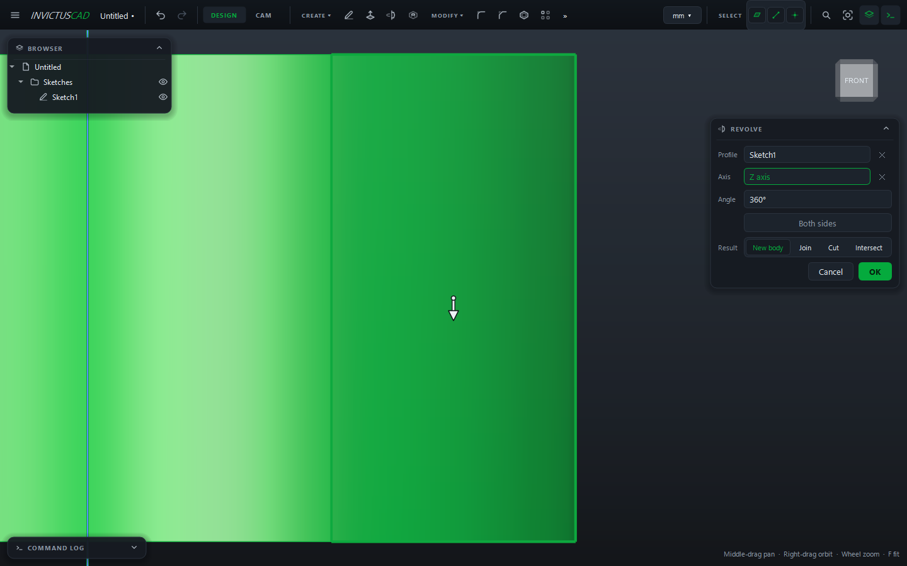

# Revolve, Sweep and Loft

These three make shapes an extrude can't: turned parts, bent tubes, transitions between shapes.
They share one way of working:

1. Choose the tool from **CREATE**. The card opens with its first pick field active.
2. Click the geometry for each field in turn. After each pick the card moves to the next empty
   field; click a field to go back to it.
3. Set the values. A preview shows the result.
4. Choose the **Result**: **New body**, **Join**, **Cut** or **Intersect**. For the last three,
   set **Body** to the body to change (it defaults to the body the sketch is on).
5. Click **OK**.

To change one later, double-click it in the browser.

## Revolve

Spins a profile around an axis: shafts, knobs, pulleys, bushings.

| Field | |
|---|---|
| **Profile** | A sketch, closed regions, or flat faces |
| **Axis** | A sketch line, a straight edge, or the X, Y or Z axis |
| **Angle** | 360° for a full turn. A negative angle turns the other way. You can also drag the arrow |
| **Both sides** | Turn half the angle each way |

!!! tip
    Draw half the part's cross-section on one side of a construction line, then revolve around
    that line.

## Sweep

Moves a profile along a path: tubes, handrails, wires, O-ring grooves.

| Field | |
|---|---|
| **Profile** | The cross-section, usually in a sketch on a plane across the path's start |
| **Path** | Edges or sketch curves, in any order, joined end to end |
| **Turn with the path** | On: the profile keeps its angle to the path, as a pipe does. Off: it keeps its orientation |

## Loft

Blends from one shape to the next: a round-to-square transition, a hull, a tapered boss.

| Field | |
|---|---|
| **Sections** | Two or more, in order: sketches, regions, faces, or a point (to come to a tip) |
| **Straight sides** | On: flat faces between sections. Off: a smooth blend |

Put the sections in sketches on parallel [reference planes](reference-planes.md) at the heights
you want.
