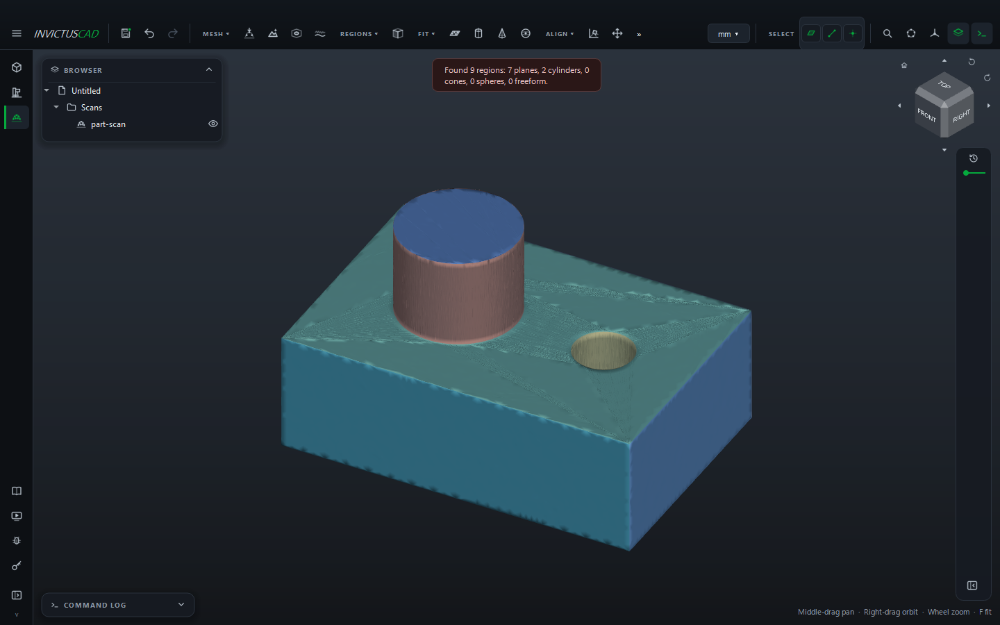
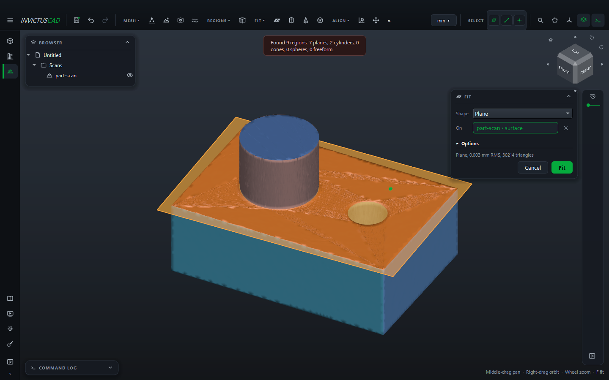

# Fit and Align

Scans come in wherever the scanner put them, and they are only triangles. Fitting finds the real
shapes in them: planes, cylinders, cones and spheres. Aligning uses those shapes to put the scan
square on the model's axes, so everything you model over it lines up.

## Auto Regions

**REGIONS › Auto Regions** divides the scan into regions. Each region is fitted as a plane,
cylinder, cone or sphere, or left freeform where nothing simple fits. The scan is colored by
region: planes in blues and teals, cylinders in oranges, cones in purples, spheres in greens,
freeform in grey.

| Value | What it does |
|---|---|
| **Sensitivity** | 0–100. Higher finds smaller regions and tells close shapes apart (a large fillet from the face next to it). Lower makes fewer, larger regions on a noisy scan |

The message after it says how many of each it found. Regions show you the part's make-up at a
glance, and fits made on a region use exactly its triangles (see below). **REGIONS › Show
Regions** turns the colors off and on.

## Fit a shape

**FIT › Fit Plane**, **Fit Cylinder**, **Fit Cone** or **Fit Sphere** opens the Fit card. Click
the scan on the surface you want. The fit grows from where you click over all of the surface that
matches the shape, and that area lights up orange. The card shows the result as you go, for
example *Cylinder Ø 12.004 mm, 0.006 mm RMS, 2,310 triangles*. Change **Shape** on the card to
try another kind on the same spot.

| Value | What it does |
|---|---|
| **Shape** | Plane, cylinder, cone or sphere |
| **On** | The spot on the scan the fit grows from |
| **Tolerance** (Options) | How far the surface may stray from the shape. **0** works it out from the scan's own noise, which is usually right |
| **Angle** (Options) | How far the surface may turn away from the shape before it stops growing (default 20°) |

If the scan has regions and you click inside a region of the same kind, the fit uses that whole
region.

Click **Fit**. The fit goes into the **Scans** folder (*Plane1*, *Cylinder1*...) and is drawn in
amber-gold. Fits are reference geometry, like [reference planes](../modeling/reference-planes.md):

- A **fitted plane** works anywhere a plane does. Start a sketch on it, cut a
  [section](model-and-compare.md#section-sketch) along it, or use it to extrude to or mirror
  across. A sketch on a fitted plane moves with it when the scan is aligned.
- A **fitted cylinder or cone** works as an axis: revolve about it, pattern around it, align to it.
- A **fitted sphere** works as a point: its center.

Fits belong to their scan. When you align or move the scan, its fits move with it.

## Align the scan

**ALIGN › Align** moves the scan onto the model's axes using its own features, usually fits:

| Value | What it does |
|---|---|
| **Primary** | The main feature: a plane (the bottom face, say) or an axis (the main bore) |
| **Onto** | Where it goes: the XY, XZ or YZ plane, or the X, Y or Z axis |
| **Flip** | Turns the scan over, if it lands upside down |
| **Secondary** (optional) | A second plane or axis that sets which way the scan turns about the primary: a side face or a second bore |
| **Onto** | The axis the secondary turns onto: X, Y or Z |
| **Flip** | The secondary the other way round |
| **Origin** (optional) | A point, axis or plane to bring to the origin: the center of a bore, a corner |

While the card is open, the scan is shown where it will go. Planes and axes also set the
position: a plane passes through the origin, an axis runs along an origin axis. Where they
disagree, **Origin** wins, then **Primary**, then **Secondary**.

For example, on a block with a bored boss: fit the bottom, the front face and the boss. Then
align with **Primary** the bottom onto **XY**, **Secondary** the front onto **Y**, and **Origin**
the boss's cylinder. The bottom then lies on XY, the front faces along Y, and the boss's axis
runs up Z through the origin.

Aligning can be undone like anything else. To start again from where the scan came in, run
`align_scan` with `reset` (see [MCP](../automation/mcp.md)), or undo.

## Move a scan by hand

**ALIGN › Move Scan** turns the scan about the model's X, Y and Z axes (through the origin) and
moves it along them. The scan is shown where it will go while the card is open. Use it to get a
scan roughly the right way up before fitting, or to nudge it.
