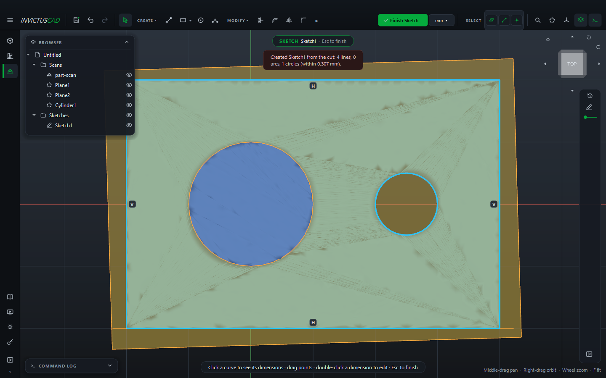
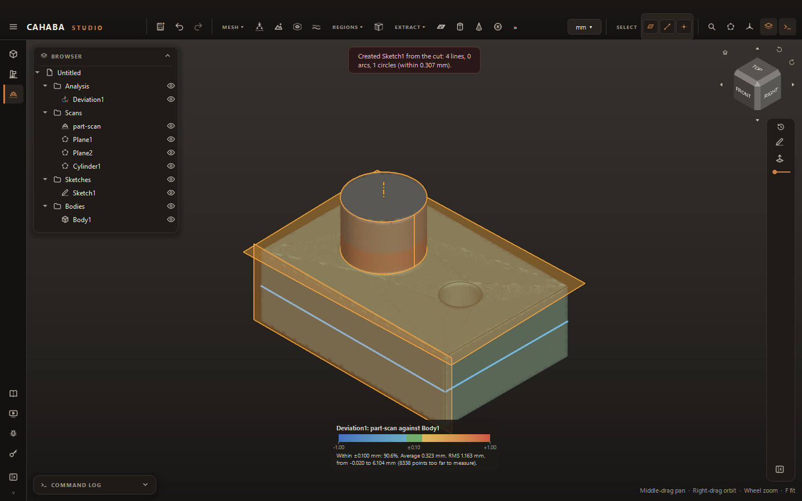

# Model and Compare

With the scan aligned, you build the model over it with sketches and features, just as in
Design. Section sketches give you the outlines to start from. Deviation shows how closely the
model matches the scan.

## Section Sketch

**MODEL › Section Sketch** cuts the scan with a plane and turns the cut into a sketch of lines and
arcs. It does not trace every bump: the lines and arcs follow the cut within a tolerance, which
is what a designer would have drawn.

| Value | What it does |
|---|---|
| **Scan** | The scan to cut |
| **Plane** | The plane to cut along: an origin plane, a [fitted plane](fit-and-align.md#fit-a-shape), a reference plane or a flat face |
| **Offset** | Moves the cut along the plane's normal. Drag the arrow, or type a value |
| **Tolerance** (Options) | How closely the lines and arcs follow the cut. **0** works it out from the scan's noise |
| **Arcs** (Options) | Fit arcs as well as lines. Off: lines only |
| **Level lines** (Options) | Lines within a degree of level or upright are made exactly so, and constrained |

The cut is drawn in blue over the scan while the card is open. Click **Sketch**. The new sketch
opens for editing, with:

- a **circle** wherever the cut goes all the way round on one circle (a bore, a boss);
- **lines and arcs** elsewhere, joined end to end where they meet (coincident constraints), so
  each closed loop is a profile ready to extrude;
- **horizontal and vertical** constraints on lines that were level or upright.

Now tidy it as you would any sketch. Add dimensions with round values, make lines parallel or
equal, delete curves you don't need, and [constrain it](../sketching/constraints.md). The scan
stays in view underneath, so you can see where it lies. Click **Finish Sketch** to get back to
the Scan to CAD toolbar.

Sketches on a fitted plane follow it if the scan is aligned again later.

## Outline Sketch

**MODEL › Outline Sketch** sketches the scan's outline as seen straight along a plane's normal:
its shadow on the plane. That gives the outer edge plus every hole that goes right through. Use
it for flat parts: a plate, a gasket, a bracket blank, a laser-cut piece. Pick the plane (usually
the fitted face the part lies on). The outline is fitted with lines and arcs like a section, with
the same **Tolerance**, **Arcs** and **Level lines** options, and the sketch opens for editing.

## Build the model

The **MODEL** panel has Design's own tools: [Extrude](../modeling/extrude.md),
[Revolve](../modeling/revolve-sweep-loft.md) (about a fitted cylinder's axis, for example),
Sweep, Loft, [Reference Plane](../modeling/reference-planes.md), Fillet, Chamfer,
[Combine](../modeling/combine-and-split.md) and [Hole](../modeling/holes-and-threads.md). The
rest of Design is a click away in the sidebar. Bodies made here are ordinary bodies, with their
features in the history.

## Deviation

**INSPECT › Deviation** compares a body with the scan. It colors every point of the scan by its
distance from the body:

- **green**: within the tolerance;
- **yellow to red**: the scan stands out from the model (the model is missing material there);
- **cyan to blue**: the scan falls short of the model (the model has material the part doesn't);
- **grey**: too far from the model to measure (a feature you haven't modeled yet).

| Value | What it does |
|---|---|
| **Scan** | The scan |
| **Body** | The body to compare |
| **Tolerance** | Within this is green (default 0.1 mm) |
| **Color range** | The distance shown at full red or blue. **0** sets it from the tolerance and the spread |

A legend at the bottom of the view shows the color scale, the share of points within tolerance,
and the average, RMS, smallest and largest distances. While a deviation is shown, its body is drawn
see-through so the colors show.

The deviation goes into the browser's **Analysis** folder. It follows the body: edit a feature,
and the colors and numbers update. Click its eye to hide it (the scan shows its regions again).
Double-click it to change the tolerance, range or body.
