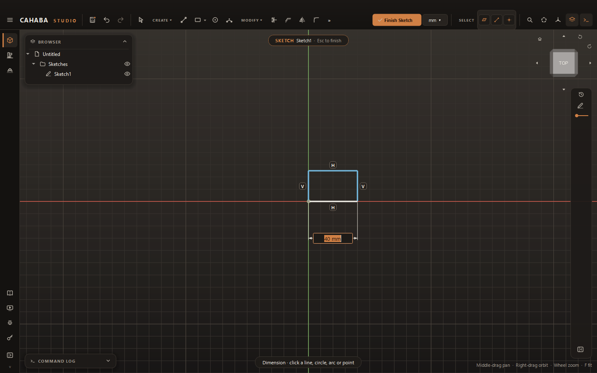

# Constraints and Dimensions

**Constraints** fix relationships (this line is horizontal, these two circles are the same size);
**dimensions** fix sizes and distances. Together they make a sketch keep its shape when you edit
it: change one dimension and the rest follows.

## Dimension (D)

The **Dimension** tool works out what you mean from what you click.

1. Press ++d++ (or **CONSTRAIN › Dimension**).
2. Click the geometry:

    | Click | Dimension |
    |---|---|
    | A circle | Diameter |
    | An arc | Radius |
    | A line, then empty space | The line's length |
    | Two parallel lines | The distance between them |
    | Two lines at an angle | The angle between them |
    | A line and a point (either order) | The distance from the point to the line |
    | Two points | A horizontal, vertical or aligned distance, depending on where you place it: above or below gives horizontal, to the side gives vertical |

    The X and Y axes count as lines, and the origin as a point.

3. Move the mouse to place the label and click.
4. The value opens for editing. Type a value or an expression (`40`, `1 1/2"`, `width / 2`) and
   press ++enter++. ++esc++ keeps the measured value.

## Geometric constraints

1. Choose a constraint from **CONSTRAIN**.
2. Click the geometry it applies to, in this order:

    | Constraint | Click |
    |---|---|
    | **Fix** | A point or curve, to lock it where it is |
    | **Coincident** | Two points, or a point and a curve |
    | **Horizontal** / **Vertical** | A line, or two points |
    | **Parallel** / **Perpendicular** / **Collinear** | Two lines |
    | **Equal** | Two lines, or two circles or arcs |
    | **Concentric** | Two circles or arcs |
    | **Tangent** | A line and a circle or arc, or two circles |
    | **Midpoint** | A point and a line |
    | **Symmetric** | Two points, then the line to mirror them about |

The constraint is added as soon as the picks are complete, and the tool stays ready for the next
one. A click that doesn't fit shows what the tool needs. ++esc++ clears the picks.

Points are picked before the curve they sit on, so click near a line's end to pick its end point.

## When a constraint is refused

Cahaba Studio won't let a constraint break the sketch. You'll see why instead:

- **"…conflicts with the sketch's other constraints"**: it contradicts something already there.
  Remove one of them first.
- **"…is redundant"**: the sketch already determines it.
- **"A dimension must be greater than zero"**, or an angle outside 0–180°.

## See what's left to constrain

- Curves are **blue** while they can still move and turn **white** when fully constrained. Each
  side of a rectangle changes on its own, so you can see which one still needs a dimension.
- Drag a point: whatever moves isn't constrained yet.

## Edit and remove constraints

In selection mode:

| To | Do |
|---|---|
| Change a dimension | Double-click its value |
| Move a dimension's label | Drag it |
| Select a constraint | Click its badge (**H**, **V**, **∥**, **⊥**, **=**, **T** and so on) or a dimension |
| Delete it | Select it and press ++delete++ |
| See what it constrains | Hover it |

A dimension driven by a [parameter](../modeling/parameters.md) shows **fx:** before its value.
