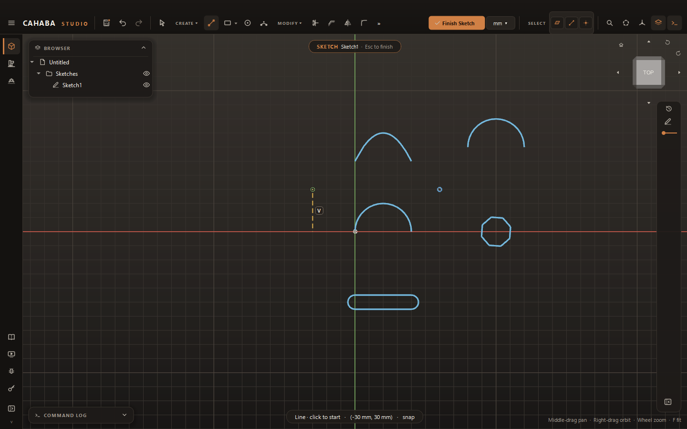

# Drawing

Pick a tool from **CREATE** (or press its key), then click in the view. A tool stays active until
you press ++esc++ or click its button again, so you can draw several shapes in a row.

## The tools

| Tool | Key | How to draw |
|---|---|---|
| **Line** | ++l++ | Click the start, then each next point. Segments chain. Click the first point to close the loop, or click the last point again (or double-click) to stop |
| **Rectangle** | ++r++ | Click two opposite corners. Makes four lines, joined and held square |
| **Center Rectangle** | ++shift+r++ | Click the center, then a corner. Construction diagonals and a center point hold it centered |
| **Circle** | ++c++ | Click the center, then a point on the circle |
| **Arc** (3-point) | ++a++ | Click the start, the end, then a point the arc passes through |
| **Center Arc** | ++shift+a++ | Click the center, then the start (this sets the radius), then move around to the end and click. It can sweep either way, past 180° |
| **Polygon** | ++g++ | Click the center, then a corner. Six sides unless you type another number; the last count is remembered |
| **Slot** | | Click the first center, the second center, then the width |
| **Spline** | ++s++ | Click the points it passes through. ++enter++, a double-click, or a second click on the last point finishes it; clicking the first point closes it |
| **Point** | ++p++ | One click |
| **Text** | | Click where it goes; see [Text](text.md) |

Rectangle and Center Rectangle share one toolbar button. It shows the one you used last; the small
arrow at its corner offers both.

## Type exact sizes while drawing

After the first click, a box beside the cursor shows the shape's values as you move the mouse.
Type to fix them:

1. Start typing a number. It goes into the first field.
2. Press ++tab++ to keep a value and move to the next field.
3. Press ++enter++ to place the shape.

| Tool | Fields |
|---|---|
| Line | **Length**, **Angle** |
| Rectangle | **Width**, **Height** |
| Circle | **Diameter** |
| Center Arc | **Radius**, then **Sweep** |
| Polygon | **Sides**, **Across flats**, **Angle** |
| Slot | **Length**, **Angle**, then **Width** |

- Values accept units and expressions: `4`, `3 1/2`, `25mm`, `width / 2`. See
  [Units and expressions](../getting-started/units-and-expressions.md).
- A typed rectangle or line grows toward the side the mouse is on.
- A typed line length, circle diameter or rectangle width and height becomes a **dimension**, so
  it stays that size. Typed angles and polygon and slot values only shape the geometry.
- ++esc++ in the box clears what you typed.

## Snapping

- The cursor snaps to existing points, ends, centers and the origin when it comes close. The
  status line shows **snap** when it does.
- A point placed on another point is joined to it with a **coincident** constraint.
- Lines within 2° of horizontal or vertical snap straight and get a **horizontal** or
  **vertical** constraint.
- Away from points, positions snap to a round increment of your unit.

## Construction geometry

Construction geometry (dashed amber) helps you place things — center lines, layout circles,
reference points — but is never part of a profile.

- **Draw as construction:** with nothing selected, press ++x++. New shapes are construction until
  you press ++x++ again (the status line says **CONSTRUCTION**).
- **Change a curve:** select it and press ++x++.

## Next

[Constraints and dimensions](constraints.md) fix the shape's size and position;
[Editing sketches](editing.md) covers moving, trimming, offsetting and patterns.
