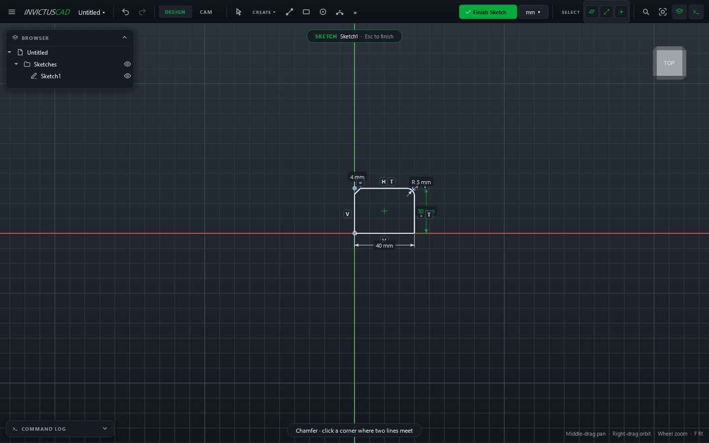
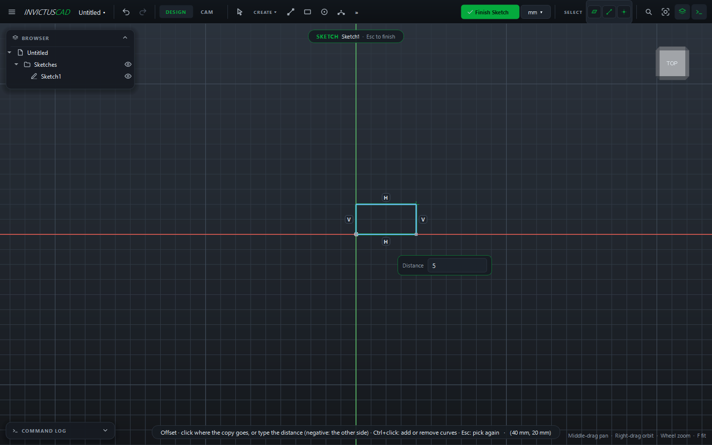
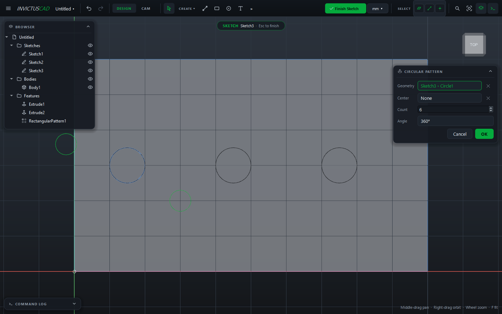
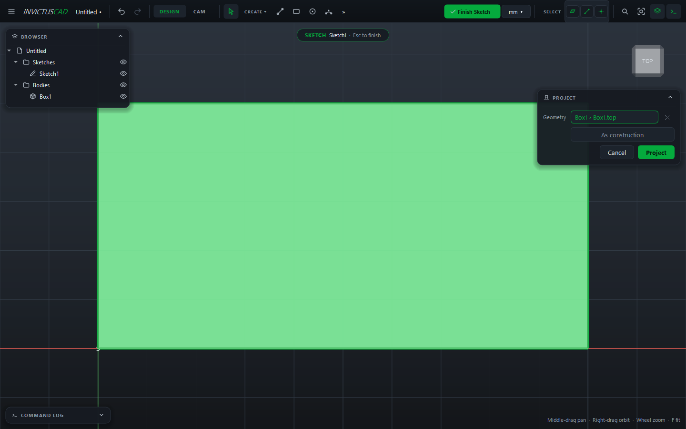

# Editing Sketches

## Select, move and delete

In selection mode (++esc++ or **Select**):

| To | Do |
|---|---|
| Select a curve | Click it. ++ctrl++ or ++shift+++click adds or removes curves |
| Move a point | Drag it. Constrained geometry follows |
| Move curves | Drag a selected curve; everything selected moves together |
| Set exact coordinates | Click a curve: the **Dimensions** card shows its values (start and end, center, diameter, radius, angles). Type and press ++enter++ |
| Delete | Select and press ++delete++ |

The Dimensions card shows:

| Curve | Fields |
|---|---|
| Line | Start X/Y, End X/Y, Length, Angle |
| Circle | Center X/Y, Diameter |
| Arc | Center X/Y, Radius, Start angle, Sweep |
| Polygon | Center X/Y, Sides, Across flats, Angle |
| Slot | Start X/Y, End X/Y, Width |
| Point | X, Y |

### Groups

Group curves that belong together, such as a logo or an imported drawing, so they select and move
as one.

- **Group:** select several curves, then **MODIFY › Group** (++ctrl+g++).
- **Ungroup:** **MODIFY › Ungroup** (++ctrl+shift+g++).
- To move one point inside a group, hold ++alt++ while dragging.

Imported drawings arrive grouped.

## Fillet and chamfer corners

1. Choose **MODIFY › Fillet** or **Chamfer**.
2. Click the **corner point** where two lines meet. The corner is rounded (or cut) straight away.
3. Type the radius or distance and press ++enter++.

The first size is a fifth of the shorter line; after that, the last size you used. The original
sharp corner stays as a construction point, so dimensions to it still work.

## Trim and extend

- **Trim:** click the piece of a curve to cut away, up to where other curves cross it. A curve
  that nothing crosses is deleted. Polygons and slots are broken into lines and arcs first.
- **Extend:** click near the end of a line or arc to lengthen it to the next curve in its way.

## Offset

Makes a parallel copy of curves at a distance, for example a wall thickness or a clearance.

1. Choose **MODIFY › Offset** (++o++).
2. Click a curve. The whole chain of joined curves is taken; ++shift+++click takes just one curve.
   (Turn **Chain Selection** off in **MODIFY** to always take one.)
3. Move the mouse to the side you want and click, **or** type the **Distance** and press ++enter++.
   A negative distance goes to the other side.

The copy keeps its distance as a dimension you can edit later.

## Mirror

1. Choose **MODIFY › Mirror**.
2. Click the curves to mirror (click again to drop one), then press ++enter++.
3. Click the mirror line, or the X or Y axis.

The copies stay symmetric with the originals: change one side and the other follows.

## Patterns

Copy curves in a grid, around a center, or along a path.

1. Choose **MODIFY › Rectangular Pattern**, **Circular Pattern** or **Path Pattern**.
2. Click the **Geometry** field, then the curves to copy.
3. Fill in the card:

    | Pattern | Fields |
    |---|---|
    | Rectangular | **Count**, **Spacing**, **Direction**; optional second direction with **Count 2**, **Spacing 2**, **Direction 2** |
    | Circular | **Center** (empty: the sketch origin), **Count**, **Angle** (360° for a full circle) |
    | Path | **Path** (curves of this sketch), **Count**, **Spacing** (0 spreads the copies over the whole path), **Turn with the path** |

4. Click **OK**.

A dotted marker sits by the copies. Click it to select them, double-click it (or any copy) to
change the pattern, and press ++delete++ with it selected to remove the copies.

## Project geometry into the sketch

**Project** brings edges, faces (their outlines), vertices, or curves from other sketches onto
this sketch's plane. The projected curves stay **linked**: when the source changes, they follow.

1. Choose **CREATE › Project**.
2. Click the geometry to bring in. Tick **As construction** to use it only for reference.
3. Click **Project**.

Projected curves are violet and can't be moved; constrain your own geometry to them.

