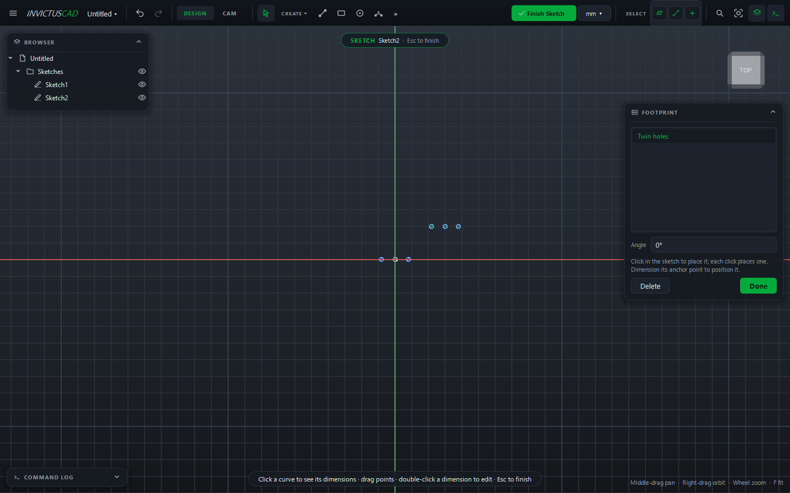

# Footprints

A **footprint** is a saved piece of sketch you reuse: the mounting holes for a switch, a connector
cut-out, a standard bolt pattern. Save it once and drop it into any sketch.

## Save a footprint

1. Draw the geometry in a sketch, with the **sketch origin** where you want the footprint's
   reference point (for example the center of the part).
2. Choose **CREATE › Save as Footprint** (or right-click the sketch in the browser, **Save as
   Footprint...**).
3. Type a name and click **OK**. If the name is taken, you're asked whether to replace it.

## Place a footprint

1. In a sketch, choose **CREATE › Insert Footprint**. The **Footprint** card lists your library.
2. Pick a footprint and set the **Angle**.
3. Click in the sketch to place it. A dashed preview follows the mouse. Each click places another
   copy.
4. Click **Done** (or press ++esc++).

Each copy has a construction **anchor point** at its reference point. Dimension the anchor to
position the copy exactly; the whole footprint moves with it.

!!! note
    Rectangles in a footprint only turn in 90° steps.

## Remove a footprint from the library

In the Footprint card, select it and click **Delete**. Sketches that already use it keep their
copies.

Footprints are stored in your user folder (`%LOCALAPPDATA%\InvictusCAD\footprints`), so they're
available in every project on that computer.
