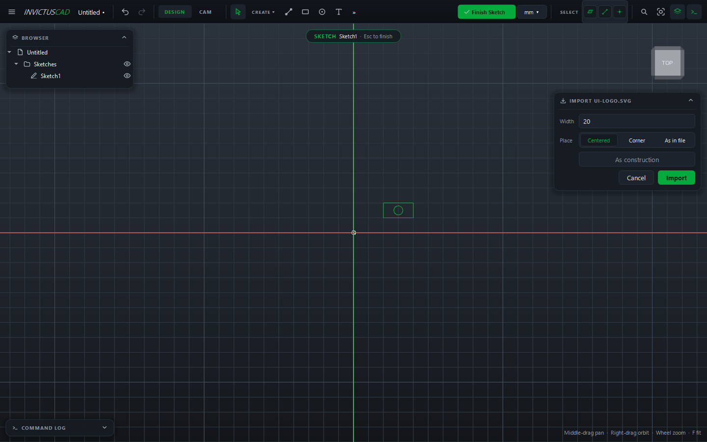

# Import and Export Drawings

## Import a drawing into a sketch

Bring in DXF, SVG, Illustrator (`.ai`) or PDF drawings, such as a logo, a panel layout from
another program, or a part outline.

1. Open the sketch to import into (or skip this to get a new sketch on XY).
2. Choose **CREATE › Import Drawing** and pick the file, **or** drag the file onto the view.
3. Set the import card:

    | Field | |
    |---|---|
    | **Width** | The drawing's width in your sketch. It starts at the drawing's own size; type a new width to scale it |
    | **Place** | **Corner** (its corner on the sketch origin), **Centered** (on the origin), or **As in file** (the file's own coordinates; the default for DXF). A dropped file is placed where you dropped it |
    | **As construction** | Import it as reference geometry only |

4. Click **Import**.

The drawing arrives as one **group**: click it to select the whole thing, drag to move it. Hold
++alt++ to drag a single point, or **Ungroup** it to work with the pieces.

## Export a sketch

For laser cutters, plasma tables and routers (LightBurn, SheetCam, Vectric and similar):

1. Right-click the sketch in the browser.
2. Choose **Export as DXF...** or **Export as SVG...** and pick where to save.

| Layer | Contains | Color |
|---|---|---|
| **CUT** | The sketch's curves | Red |
| **ENGRAVE** | Text, as outlines | Blue |

Construction geometry is left out. Sizes are in your document's unit. DXF files are R12, which
nearly every program reads.

To export a **solid part** flat, with its outline, holes and engraving on separate layers, see
[Flat parts](../making/flat-parts.md).
