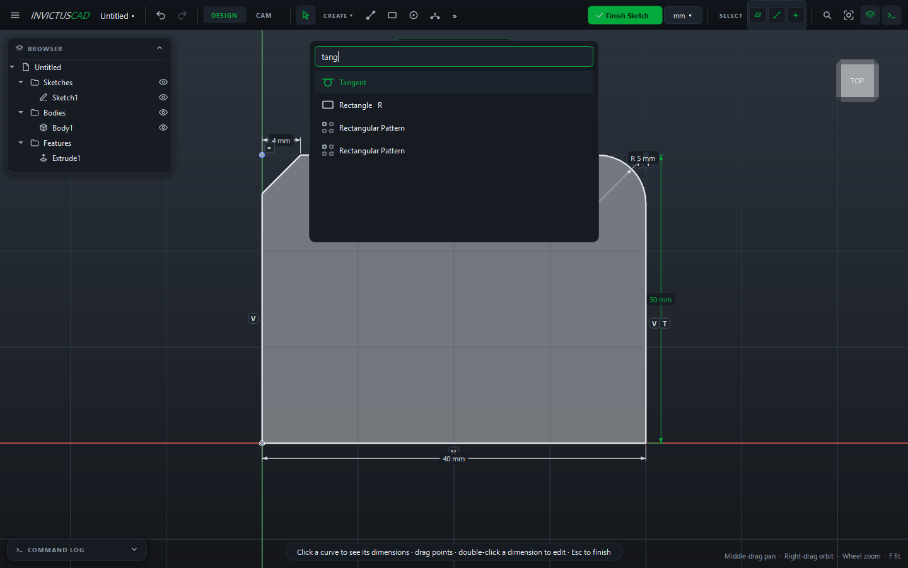

# Sketch Basics

Most parts start as a **sketch**: 2D geometry drawn on a flat plane, which you then
[extrude](../modeling/extrude.md), revolve, sweep or loft into a solid.

## Start a sketch

1. In the **DESIGN** workspace, click **Sketch** in the **CREATE** panel.
2. Choose where to draw:
    - **On a face:** select one flat face of a body first, then click **Sketch**. The sketch is
      created on that face straight away.
    - **On a plane:** with nothing selected, click **Sketch**. The three origin planes appear —
      XY (blue), XZ (green) and YZ (red) — along with any [reference planes](../modeling/reference-planes.md).
      Click one, or click any flat face. **Esc** cancels.

The view turns to face the sketch plane and a grid appears, with the X axis in red and the Y axis
in green. Bodies fade so you can see through them. The banner at the top shows the sketch's name.

!!! tip
    Dropping a DXF or SVG file onto the view with no sketch open creates a sketch on XY and imports
    the drawing into it. See [Import and export drawings](import-export.md).

## The sketch toolbar

While a sketch is open the toolbar shows:

| | |
|---|---|
| **Select** | Put the active tool down and go back to selecting (**Esc** does the same) |
| **CREATE** | Line, Rectangle, Circle, Arc, Center Arc, Polygon, Slot, Spline, Point, Text, Project, Import Drawing, Insert Footprint, Save as Footprint |
| **MODIFY** | Trim, Extend, Offset, Mirror, Fillet, Chamfer, patterns, Convert to Outlines, Group, Ungroup, Construction, Parameters |
| **CONSTRAIN** | Dimension and the geometric constraints |
| **Extrude** | Finish the sketch and extrude it |
| **Finish Sketch** | Close the sketch |

Each panel shows four tools. Click the panel's name (for example **CREATE ▾**) to see all of them.
To choose which four are shown, open the panel's menu, then **Toolbar**: show your **pinned**
tools, or the **last four used**, and tick the tools to pin.

To find any tool by name, press ++ctrl+k++, type part of its name and press ++enter++.

## Finish a sketch

- Click **Finish Sketch**, or
- press ++esc++ until the sketch closes. Each press steps back one level: it first cancels what
  you're in the middle of, then puts the tool down, then finishes the sketch.
- ++e++ finishes the sketch and opens [Extrude](../modeling/extrude.md) with it.

## Edit a sketch later

Double-click the sketch in the browser. Everything built from it updates when you finish.

## How sketches behave

- **Closed regions become profiles.** A shape inside another is a hole: a circle inside a
  rectangle extrudes as a plate with a hole.
- **Constraints keep your intent.** Lines drawn nearly horizontal or vertical snap straight and are
  held there; points dropped on other points join them. See
  [Constraints and dimensions](constraints.md).
- **A curve turns white when it's fully constrained**, so you can see what can still move.
- **Construction geometry** (dashed amber) guides constraints but is never part of a profile.
- **Every step is undoable** with ++ctrl+z++. A shape and the constraints added with it undo
  together.

Next: [Drawing](drawing.md).
