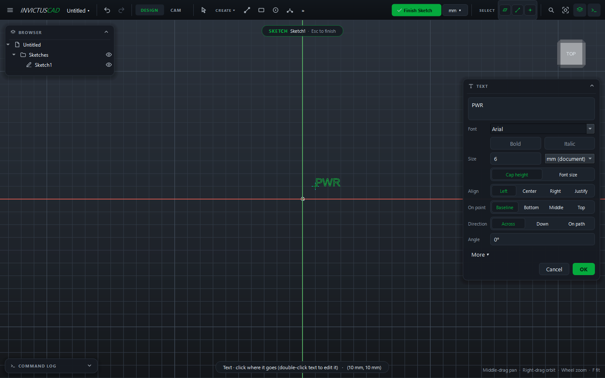
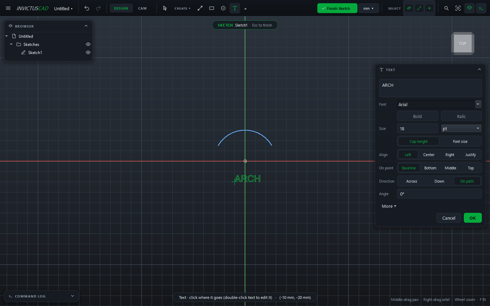

# Text

Text in a sketch is real geometry: it can be extruded, cut, engraved, or exported to the laser.

## Add text

1. In a sketch, choose **CREATE › Text**.
2. Click where the text goes. The **Text** card opens.
3. Type the text (++enter++ for a new line) and set its style.
4. Click **OK**, or press ++ctrl+enter++.

| Field | |
|---|---|
| **Font**, **Bold**, **Italic** | Any font installed on your computer |
| **Size** | In your document's unit, points, mm, cm or inches |
| **Cap height** / **Font size** | Whether the size is the height of a capital letter (what you'd measure on the part) or the font's nominal size |
| **Align** | **Left**, **Center**, **Right** or **Justify** |
| **On point** | Which part of the text sits on the point you clicked: **Baseline**, **Bottom**, **Middle** or **Top** |
| **Direction** | **Across**, **Down** (stacked letters), or **On path** |
| **Angle** | Turn the text |
| **More ▾** | Line spacing (**Leading**), letter spacing (**Tracking**, **Kerning**), **All caps**, **Width** and **Height** stretch, **Shift** and **Turn** |

## Text along a curve

1. Set **Direction** to **On path**.
2. Click the **Path** field, then a line, arc or circle in the sketch.
3. Use **Offset** to lift the text off the curve and **Flip** to put it on the other side.

## Change text

Double-click the text. The card opens with its settings; change them and click **Update**.

## Convert to outlines

**MODIFY › Convert to Outlines** (with text selected) turns the text into ordinary lines and
curves, which you can then edit point by point. The text can't be retyped afterwards.

When you export a sketch to DXF or SVG, text is written as outlines on the **ENGRAVE** layer
automatically; you don't need to convert it first.
